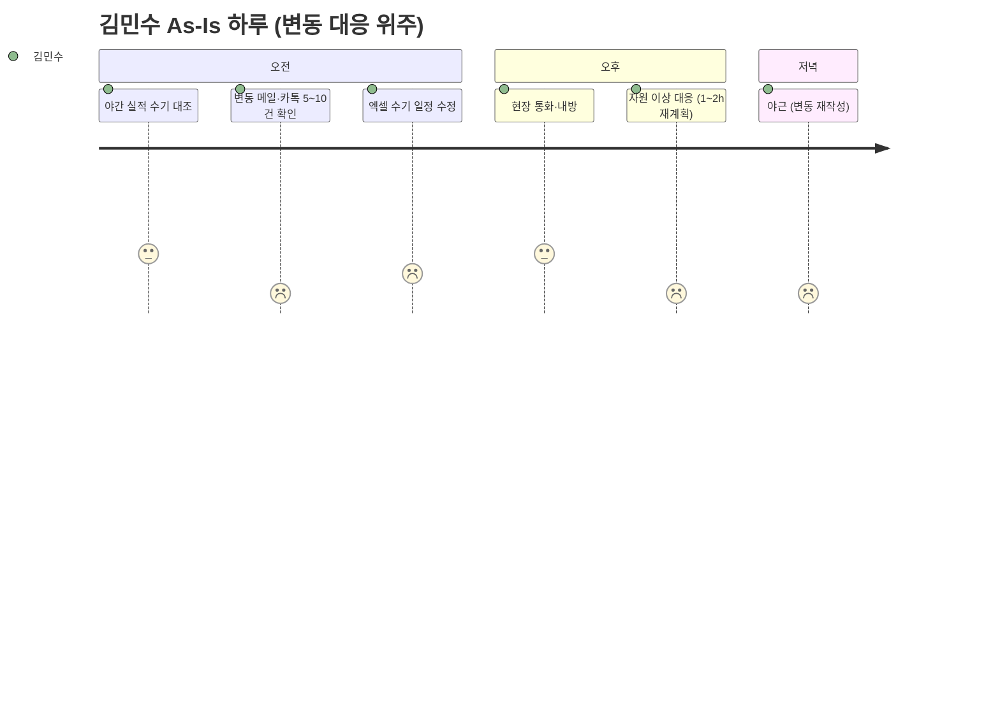
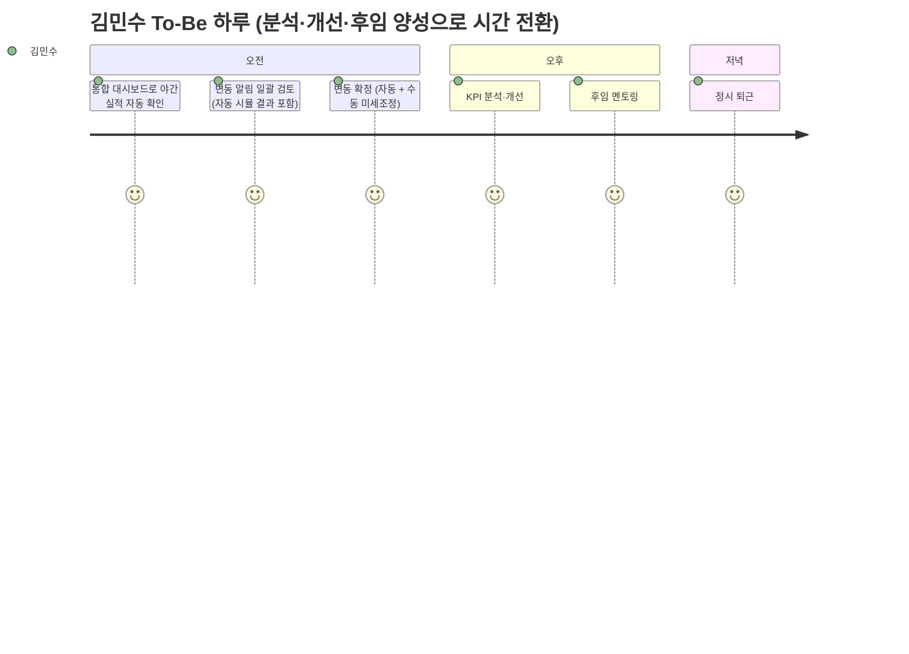
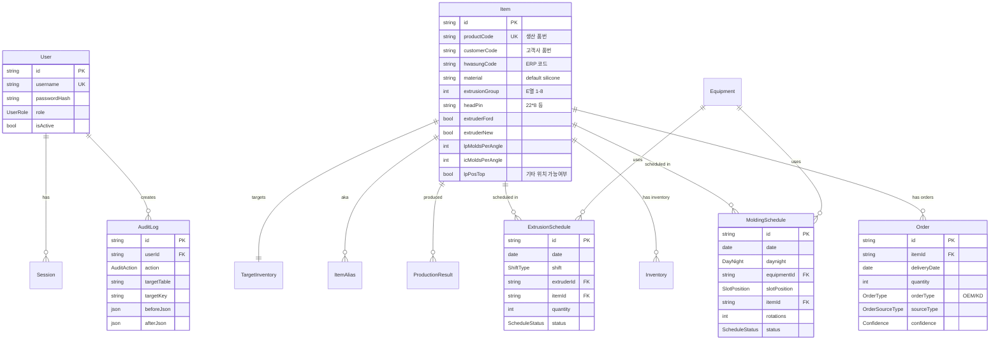
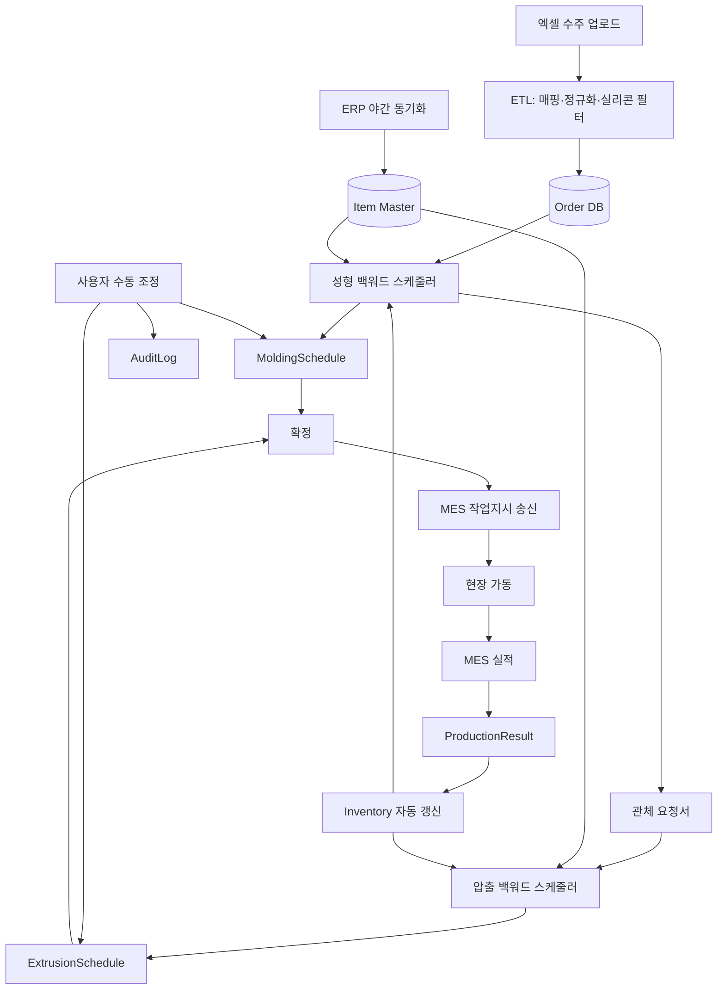
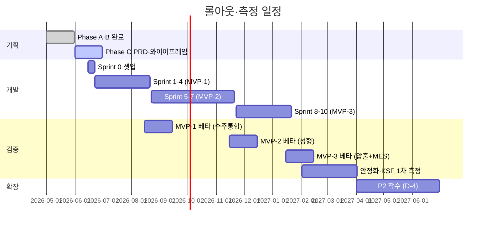
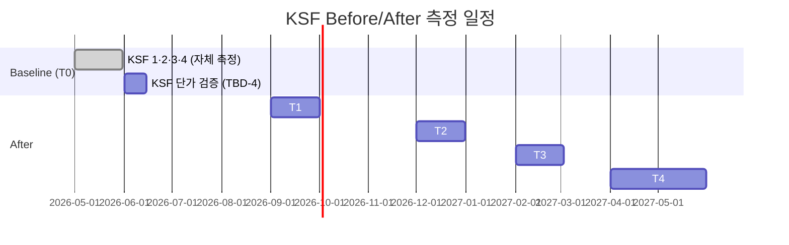

# 사내 생산 스케줄링 시스템 — PRD v1.2

| 항목 | 내용 |
|---|---|
| 문서명 | PRD — 통합 요구사항 명세서 |
| 문서 번호 | 17 |
| 버전 | **v1.2** (측정 가능성·검증 가능성 보강) |
| 최종 업데이트 | 2026-05-10 |
| Owner 팀 | 경영기획 본부 |
| 문서 성격 | **AI 페어 코딩 직접 구현용 PRD** (외주용 RFP 아님) |
| 입력 자료 | 개발계획서 #4 / 문제정의서 #6 / 페르소나 #8 / 여정맵 #9 / JTBD #10 / VPS #13 / PRD v1.0 #15 / PRD v1.1 #16 |
| 다음 산출물 | 와이어프레임 (선택) 또는 Sprint 0 코드 시작 |
| v1.1 → v1.2 변경 | **5개 영역 측정·검증 가능성 보강**: ① KPI 측정 경로(SQL/metric) 명시 ② **AC 실패 케이스 추가** (각 Story당 1+ 예외 AC, +14건) ③ NFR 측정 도구 명시 (k6·Lighthouse·Grafana·Prometheus·Sentry) ④ Differential Value 측정 방법·기준선 출처 ⑤ Proof ↔ Experiment 매핑 표 신설 |
| v1.0 → v1.1 변경 | **9개 섹션 전면 보강**: ① Pain·Outcome 수치화 ② JTBD → User Story + AC(Given/When/Then × 3) ③ 북극성 KPI + 보조 KPI + 측정 주기 ④ Differential Value 수치 비교 ⑤ Proof 통합 + ⑥ MoSCoW + ⑦ 실험·롤아웃 신설 + ⑧ Mermaid 다이어그램 + ⑨ 기존 구현 상세 부록 정리 |

---

# 0. 본 PRD 사용 방법

## 0.1 독자별 활용 경로

| 독자 | 읽을 곳 |
|---|---|
| 임원·재무 (의사결정) | **§1·§7·§8** + VPS #13 |
| 기획자·아키텍트 (검토) | §1~§9 (전체) |
| 개발자 (AI 페어 코딩) | §3 AC + §6 데이터 + **부록 전체 (A~I)** |
| QA·테스터 | §3 AC + §5 NFR + §8 측정 |

## 0.2 코딩 흐름
```
[1] §3 사용자 스토리 + AC → 기능 단위 코드 작성
[2] 부록 C Prisma 스키마 → DB 마이그레이션
[3] 부록 E·F → 페이지·Server Action 구현
[4] §5 NFR + §3 AC 임계치 → 자동 테스트 작성
[5] 결과 측정 (§8) → KSF 자동 산출
```

---

# 1. 개요·목표

## 1.1 정체성·컨텍스트
- **사내 자동차부품 고무호스 제조사**의 생산 스케줄링 자동화 웹앱
- 1차 도입 = **'실리콘' 부품 47품번 한정** (D9). EPDM·NBR 등으로 점진 확대
- 사용자 20명 (생산관리·현장관리자·영업·경영진·Admin)
- 사내망 전용 (D8) — Vercel/Supabase/외부 LLM 사용 금지

## 1.2 문제 정의 (Pain·실패 KPI 수치화)

| 영역 | Pain | 실패 KPI (현재 측정값) |
|---|---|---|
| **납기** | 변동 영향을 일일이 확인해야 함 | 변동 영향 파악 시간 **4시간/회**, 납기 사고율 **7%** (납기율 93%) |
| **공정 손실** | 다이/노즐 변경 누적, E그룹 묶음 시간 부족 | 다이/노즐+금형 변경 **일 5~10회** (월 ≈ 165회, 라인 비가동 **월 55~110시간**) |
| **베테랑 의존** | 25년 경험에 의존, 위임 불가 | 결정 **0.5~1시간/일**, 위임 가능 후임 **0명** |
| **데이터 분산** | 엑셀 3종·메일·전화·카톡 분산 | 데이터 일원화 **0%**, 통합 시간 **주 4시간** |
| **변동 대응 부담** | 주 5회 변동, 진행중 건 영향 추적 | 야근 발생, 변동 대응 **주 20시간** |
| **인수인계 곤란** | 제약변수 머리에만 존재 | 신입 양성 시간 **TBD** |

## 1.3 목표 (Desired Outcome 수치화)

본 시스템 도입 12개월 후 다음 정량 결과를 달성한다:

| Outcome | 현재 | 12개월 후 목표 | 개선폭 |
|---|---|---|---|
| 납기 준수율 | 93% | **≥ 99%** | +6%p |
| 다이/노즐+금형 변경 | 일 5~10회 | **-30%** (일 3.5~7회) | -30% |
| 변동 영향 파악 시간 | 4시간 | **≤ 5분** | **-98% / 약 48배** |
| 스케줄링 작업시간 | 주 24시간 | **-50%** (주 12시간) | -50% |
| 데이터 일원화 | 0% | **100%** | 신규 자산 |
| 시스템 채택률 | - | **≥ 90%** | (출시 3개월 후) |

## 1.4 성공 지표 (북극성 KPI + 보조 KPI)

### 🌟 북극성 KPI (NSM)
> **납기 준수율 (KSF-1)** — 모든 비즈니스 가치의 최종 지표

| 항목 | 값 |
|---|---|
| 정의 | (D-2/D-1 룰 충족 건수) ÷ (총 수주 건수) × 100 |
| 기준선 (Baseline) | **93%** (2026-05-10 검증) |
| 목표 (Target) | **≥ 99%** (12개월 후) |
| 측정 주기 | **일 단위** 자동 산출 (매일 23:55 cron), **주간** 집계, **월간** 보고 |
| 데이터 출처 | `Order` ↔ `ProductionResult` 조인 |
| **측정 SQL** | ```SELECT COUNT(*) FILTER (WHERE pr.completed_at <= o.delivery_date - INTERVAL '2 days') * 100.0 / COUNT(*) AS punctuality FROM "Order" o JOIN "ProductionResult" pr ON pr.item_id = o.item_id AND pr.process = 'MOLDING' WHERE o.delivery_date BETWEEN $start AND $end;``` |
| **측정 도구** | PostgreSQL + Grafana 대시보드 (`/admin/kpi/punctuality`) |
| **저장 위치** | `KsfDailySnapshot` 테이블 (자동 적재) |

### 보조 KPI (5개)

| KPI | 기준선 | 목표 | 측정 주기 | 출처 | **측정 정의 (정확)** | **측정 도구** |
|---|---|---|---|---|---|---|
| **KSF-2** 다이/노즐+금형 변경 | 일 5~10회 | -30% | 일 단위 | `ExtrusionSchedule` setup_change 카운트 + MES 실적 | `COUNT(DISTINCT (date, shift, extruder, head_pin || '_' || extrusion_group))` 단조변경 카운트 | Grafana + DB |
| **KSF-3** 변동 영향 시간 | 4시간 | ≤ 5분 | 변동 발생 시 | App 로그 (Sentry/구조화 로그) | `simulate_started_at` ↔ `simulate_completed_at` 차이 (App 로그 키: `event=simulate_impact`) | Sentry + Loki |
| **KSF-4** 스케줄링 작업시간 | 주 24h | -50% | 주 단위 | App 세션 + Audit | `AuditLog` 중 `targetTable IN ('MoldingSchedule','ExtrusionSchedule','Order')` 의 사용자별 일주일 누적 사용 시간 (세션 활성 시간) | Plausible(self-host) + DB |
| **KSF-5** 데이터 일원화 | 0% | 100% | 월 단위 | `Order.sourceType` 분포 + 미매핑 건수 | `100 - (count(unmatched) / count(all) * 100)` (unmatched = ItemAlias 미매칭) | DB 쿼리 |
| **KSF-6** 시스템 채택률 | - | ≥ 90% (3개월 후) | 월 단위 | `Session` ↔ 대상 사용자 | `count(distinct userId where last_login >= NOW() - 30d) / count(active users)` | DB |

### 측정 인프라 요약
- **DB Cron Job**: 매일 23:55 — KSF-1·2·5·6 자동 산출 → `KsfDailySnapshot` 적재
- **App 로그**: 구조화 로그 (event 필드) — Loki 또는 PostgreSQL `EventLog` 테이블
- **대시보드**: Grafana — `/admin/kpi/*` 패널 (Sprint 11에서 구축)
- **수동 보정**: KSF-4의 자가보고 항목은 월 1회 사용자 입력 폼

---

# 2. 사용자와 페르소나

## 2.1 페르소나 5종 + Admin

| Role | 이름 | 디지털 친숙도 | 사용 빈도 | 채택 거부 리스크 |
|---|---|---|---|---|
| 생산관리 (PRODUCTION_MANAGER) | 김민수 (38·12년) | ★★★★☆ | 매일 4h+ (주사용자) | 낮음 |
| 성형 반장 (MOLDING_LEADER) | 박철수 (49·25년) | ★★☆☆☆ | 매일 30~60분 | **🔴 높음 — 도입 성패** |
| 압출 반장 (EXTRUSION_LEADER) | 이영호 (45·20년) | ★★★☆☆ | 매일 1h | 🟡 중간 |
| 영업·구매 (SALES_PURCHASE) | 정수진 (32·6년) | ★★★★☆ | 주 단위 | 낮음 |
| 경영진 (EXECUTIVE) | 임원 | ★★★★☆ | 주·월 단위 | 낮음 |
| Admin | 시스템 관리자 | ★★★★★ | 운영 시 | - |

> 상세: `Phase_B/8_페르소나_v1.1.md`, `Phase_B/9_업무여정맵_v1.0.md`

## 2.2 핵심 JTBD (14건 → User Story로 §3에서 변환)

| JTBD | 페르소나 | 우선순위 |
|---|---|---|
| J-PM-1 변동 5분 영향 시뮬 ⭐ | 김민수 | P0 |
| J-PM-2 자동 백워드 + 수동 ⭐ | 김민수 | P0 |
| J-PM-3 제약변수·이력 명문화 | 김민수 | P0 |
| J-PM-4 자원 이상 시뮬 | 김민수 | P1 |
| J-MR-1 태블릿 본인 공정 ⭐ | 박철수 | P0 |
| **J-MR-2 수동 보정 권한 ⭐⭐ (도입 성패)** | 박철수 | P0 |
| J-MR-3 5초 자동 초안 ⭐ | 박철수 | P0 |
| J-ER-1 E그룹 자동 묶음 ⭐ | 이영호 | P0 |
| J-ER-2 자동 + 수동 미세조정 | 이영호 | P0 |
| J-ER-3 부하 분산 시각화 | 이영호 | P0 |
| J-SP-1 통합 입력 1회 ⭐ | 정수진 | P0 |
| J-SP-2 Audit + 즉시 알림 | 정수진 | P0 |
| J-EX-1 모바일 KSF 한 화면 | 경영진 | P2 |
| J-EX-2 도입 ROI 자동 비교 | 경영진 | P2 |

## 2.3 사용자 여정 요약 (Mermaid)

### As-Is (현재) — 김민수 과장 하루


### To-Be (도입 후) — 김민수 과장 하루


> 5개 페르소나 전체 여정맵: `Phase_B/9_업무여정맵_v1.0.md`

---

# 3. ★ 사용자 스토리와 수용 기준 (AC, Given/When/Then × 3+ 실패 AC)

본 PRD의 **검증 가능한 코딩 사양**. 14개 JTBD 모두를 사용자 스토리로 변환.

**v1.2 보강**: 각 Story당 **정상 AC 3개 + 실패/예외 AC 1개** = 총 **56개 AC**. 모든 AC는 자동 테스트 변환 가능 (Vitest unit / Playwright E2E).

**AC 표기 규칙**:
- **정상 AC** — 일반 흐름 (Given/When/Then + 정량 임계치)
- **🔥 실패 AC** — 예외·실패 케이스 (잘못된 입력·동시성·외부 의존 실패·권한)

## 3.1 김민수 과장 (생산관리) — 4 Story

### Story PM-1 (J-PM-1) — 변동 5분 영향 시뮬 ⭐
> **As a** 생산관리 담당자, **I want to** 수주 변동 입력 즉시 진행 중인 압출/성형 건의 영향을 시각화할 수 있어야 한다, **so that** OEM 납기 사고를 사전에 차단하고 주간 회의에서 즉답할 수 있다.

| AC# | Given / When / Then |
|---|---|
| **AC PM-1-1** | **Given** 변동 입력 화면 (W-3)에 사용자가 진입 / **When** 폼에 품번·변경유형·수량을 입력하고 "시뮬" 버튼 클릭 / **Then** **5초 이내** 영향받는 진행중 건 목록과 **🔴(STARTED)/🟡(CONFIRMED)/🟢(AUTO)** 색상 코딩 결과가 표시된다 |
| **AC PM-1-2** | **Given** 시뮬 결과가 표시된 상태 / **When** 사용자가 결과 카드 클릭 / **Then** 해당 스케줄 행으로 W-4·W-5 간트 화면 자동 이동, **응답 ≤ 1초** |
| **AC PM-1-3** | **Given** 변동을 "확정"으로 저장 / **When** 저장 버튼 클릭 / **Then** Order 테이블 갱신 + AuditLog 자동 기록(user, before, after, timestamp) **0.5초 내**, 영향받는 사용자에게 알림 발송 |
| **🔥 AC PM-1-F1** (실패) | **Given** 변동 입력 화면, MES 시스템이 다운 상태 / **When** "시뮬" 버튼 클릭 / **Then** **DB 기반 진행률만 사용한 "Degraded Mode" 시뮬 결과 표시** (≤ 7초), 화면 상단 노란 배너 "MES 미연결 — 일부 정확도 ↓", 사용자가 "확정" 가능하지만 audit에 `degraded=true` 기록 |

### Story PM-2 (J-PM-2) — 자동 백워드 + 수동 조정 ⭐
> **As a** 생산관리 담당자, **I want to** 시스템이 자동으로 D-2/D-1 백워드 스케줄을 생성하되 내가 최종 수동 조정할 수 있어야 한다, **so that** 베테랑 직관과 자동 알고리즘의 장점을 결합하여 납기를 100% 지킬 수 있다.

| AC# | Given / When / Then |
|---|---|
| **AC PM-2-1** | **Given** 통합 대시보드에서 "주간 스케줄 생성" 클릭 / **When** 47품번 + 마스터 + 캘린더 입력 / **Then** **5초 이내** 성형 + 압출 자동 초안 생성 (status: AUTO), 룰 위반 시 경고 표시 (차단 X) |
| **AC PM-2-2** | **Given** 자동 초안이 표시된 간트 / **When** 슬롯 드래그 또는 수량 변경 / **Then** **500ms 이내** 화면 반영, status: AUTO → MANUAL, AuditLog 자동 기록 |
| **AC PM-2-3** | **Given** 모든 검토 완료 / **When** "확정" 버튼 클릭 / **Then** status: MANUAL → CONFIRMED, MES로 작업지시 송신 (Sprint 9 이후), 1초 내 완료 알림 |
| **🔥 AC PM-2-F1** (실패) | **Given** 자동 생성 시도, **47품번 중 일부에 슬롯 할당 불가** (예: 모든 위치 X) / **When** 자동 생성 / **Then** **부분 성공 결과 반환** — 할당된 건은 status: AUTO, 미할당 건은 별도 "할당 불가" 목록 표시 (≤ 5초), 사용자가 수동 처리 가능, AuditLog `partial_success=true` |

### Story PM-3 (J-PM-3) — 제약변수·이력 명문화
> **As a** 생산관리 담당자, **I want to** 모든 제약변수와 변경 이력이 시스템에 명문화되기를 원한다, **so that** 휴가·인사이동 시에도 후임이 즉시 인수하여 사고 없이 운영이 이어진다.

| AC# | Given / When / Then |
|---|---|
| **AC PM-3-1** | **Given** 마스터 화면 (W-6) / **When** 운영 파라미터(회전수·근무시간·효율 등)를 GUI에서 수정 / **Then** 코드 수정 없이 즉시 적용, AuditLog 자동 기록 |
| **AC PM-3-2** | **Given** 모든 변경 이벤트 (마스터·수주·스케줄·재고 등) / **When** 사용자가 변경 / **Then** AuditLog에 (user, role, timestamp, table, key, before, after, reason, IP, sessionId) **모두 기록** |
| **AC PM-3-3** | **Given** Audit 로그 데이터 / **When** 5년 후 / **Then** 데이터 **여전히 조회 가능** (자동차부품 OEM 추적성) |
| **🔥 AC PM-3-F1** (실패) | **Given** 두 사용자(A·B)가 같은 마스터 행을 동시 편집 / **When** A가 먼저 저장 후 B가 저장 시도 / **Then** B에게 **충돌 감지 알림 + 변경사항 비교 화면**, B가 "재시도" 또는 "포기" 선택 가능 (낙관적 락 — `updatedAt` 비교) |

### Story PM-4 (J-PM-4) — 자원 이상 시뮬 (P1)
> **As a** 생산관리 담당자, **I want to** 설비 고장·자재 부족·인원 부족(연차) 시 자원 이상 시뮬레이션을 사용할 수 있어야 한다, **so that** 1~2시간 걸리던 재계획을 5분에 끝내고 야근을 줄일 수 있다.

| AC# | Given / When / Then |
|---|---|
| **AC PM-4-1** | **Given** 자원 이상 입력 화면 / **When** "가류기 1호기 X일 가동 불가" 입력 / **Then** 영향받는 건 자동 식별, **5분 내** 재계획 옵션 제시 |
| **AC PM-4-2** | **Given** 재계획 옵션 표시 / **When** 옵션 선택 / **Then** 일정 자동 재배치, 변경 사항 W-4·W-5에 반영 |
| **AC PM-4-3** | **Given** 시뮬 결과 / **When** 출력 요청 / **Then** 영향받는 건의 변경 전·후 비교 보고서 PDF 생성 (≤ 30초) |
| **🔥 AC PM-4-F1** (실패) | **Given** 자원 이상 입력 시 **잘못된 입력** (가류기 ID 미존재, 일자가 과거) / **When** 저장 / **Then** Zod 검증 실패 → **필드별 빨간 인라인 에러 메시지**, 저장 차단, audit 미기록 |

## 3.2 박철수 반장 (성형) — 3 Story

### Story MR-1 (J-MR-1) — 태블릿 본인 공정 한 화면 ⭐
> **As a** 성형 반장, **I want to** 새벽 교대 직후 태블릿 한 화면에 본인 가류기의 일정(슬롯·앵글·회전수)이 정리되기를 원한다, **so that** 종이·카톡을 거치지 않고 즉시 작업 시작할 수 있다.

| AC# | Given / When / Then |
|---|---|
| **AC MR-1-1** | **Given** 박철수 계정으로 태블릿 로그인 / **When** W-4 진입 / **Then** **본인 권한 가류기만 표시** (RBAC), 글씨 **≥ 16px**, 버튼 **≥ 44×44px** |
| **AC MR-1-2** | **Given** 본인 공정 화면 / **When** 가로/세로 회전 / **Then** 반응형 레이아웃, **모든 정보가 1화면에 표시** (스크롤 최소화) |
| **AC MR-1-3** | **Given** MES 실적 들어옴 / **When** 5분 주기 동기화 / **Then** 진행률 자동 갱신, 완료 슬롯은 status: COMPLETED 표시 |
| **🔥 AC MR-1-F1** (실패) | **Given** 박철수가 압출 라인 권한 없음 / **When** URL 직접 입력으로 `/extrusion` 접근 시도 / **Then** **403 Forbidden 페이지** + 사이드바에서 압출 메뉴 자체 미표시 (RBAC), 시도는 audit `unauthorized_access` 기록 |

### ⭐⭐ Story MR-2 (J-MR-2) — 수동 보정 권한 (도입 성패 결정)
> **As a** 성형 반장, **I want to** 자동 스케줄이 25년 경험상의 직관과 어긋날 때 시스템이 강제하지 않고 내 수동 보정을 받아주고 경고만 표시해주기를 원한다, **so that** 시스템을 신뢰하면서도 내 판단의 자율성을 유지할 수 있다.

| AC# | Given / When / Then |
|---|---|
| **AC MR-2-1** | **Given** 자동 생성된 슬롯 (status: AUTO) / **When** 사용자가 다른 가류기·일자로 드래그 / **Then** **차단 없이 변경 허용**, status: AUTO → MANUAL, 응답 **≤ 500ms** |
| **AC MR-2-2** | **Given** 슬롯 위치 가능여부가 X인 슬롯에 배치 시도 / **When** 드래그 완료 / **Then** **빨간 토스트 경고만 표시** ("위치 X — 가능여부 X"), **그러나 배치는 그대로 허용**, AuditLog에 위반 기록 |
| **AC MR-2-3** | **Given** 자동 vs 수동 결과 / **When** 화면 표시 / **Then** **시각 구분**: 자동 = 회색 배경, 수동 = 파란 테두리, 확정 = 초록 체크 아이콘 |
| **🔥 AC MR-2-F1** (실패 — 동시성) | **Given** 두 반장(박·이)이 동일 슬롯을 동시에 드래그 / **When** 박 먼저 저장, 이 두 번째 저장 시도 / **Then** 이 화면에 **"이 슬롯이 방금 변경되었습니다 — 새로고침"** 안내, 충돌 해결 후 재시도. 응답 ≤ 1초, audit에 `optimistic_lock_conflict=true` |

### Story MR-3 (J-MR-3) — 5초 자동 초안 ⭐
> **As a** 성형 반장, **I want to** 슬롯 위치 제약이 많아 한 번에 계산할 수 없을 때 시스템이 5초 안에 초안을 제시하기를 원한다, **so that** 내 결정시간 0.5~1시간을 절약하고 가동을 빨리 시작할 수 있다.

| AC# | Given / When / Then |
|---|---|
| **AC MR-3-1** | **Given** 47품번 + 마스터 + 수주 데이터 / **When** "자동 생성" 클릭 / **Then** **5초 이내** 슬롯 배치 초안 완성, p95 응답 **≤ 5000ms** |
| **AC MR-3-2** | **Given** 자동 생성 결과 / **When** 슬롯 cell hover / **Then** **툴팁으로 근거 표시** (예: "RH-A123 — 저압 상단 가능, 앵글 보유 1, 합금형 2") |
| **AC MR-3-3** | **Given** 위치 제약 (O/X) 데이터 / **When** 자동 생성 / **Then** **위치 X 슬롯에는 배치 0건** (정확도 100%), 단 사용자 수동 보정 시 위 AC MR-2-2 적용 |
| **🔥 AC MR-3-F1** (실패 — 데이터 결손) | **Given** 새 품번이 마스터에 등록되었으나 **위치 가능 여부 (O/X) 미입력** / **When** 자동 생성 / **Then** 해당 품번은 **"마스터 데이터 부족 — 위치 정보 필요"** 경고 목록에 추가, 다른 품번은 정상 처리, 사용자가 마스터 화면으로 이동 가능한 링크 제공 |

## 3.3 이영호 반장 (압출) — 3 Story

### Story ER-1 (J-ER-1) — E그룹 자동 묶음 ⭐
> **As an** 압출 반장, **I want to** 시스템이 같은 E그룹·헤드핀 품번들을 한 근무시간에 묶어 배치하기를 원한다, **so that** 다이/노즐 변경 횟수를 줄이고 라인 가동률을 높일 수 있다.

| AC# | Given / When / Then |
|---|---|
| **AC ER-1-1** | **Given** 47품번의 E그룹 (1~8) + 헤드핀 데이터 / **When** 자동 압출 스케줄 생성 / **Then** **같은 (E그룹, 헤드핀) 그룹의 품번이 동일 근무시간에 묶임** (셋업 횟수 -30% 시뮬) |
| **AC ER-1-2** | **Given** 묶음 결과 / **When** 간트 표시 / **Then** **E그룹별 색상 코딩** (1=빨강, 2=주황...) 으로 시각화, 묶음 경계 명확 |
| **AC ER-1-3** | **Given** 베이스라인 (수기 묶음) vs 자동 묶음 / **When** 출력 / **Then** **다이/노즐 변경 횟수 비교** (현재 vs 자동) 카운터 표시 |
| **🔥 AC ER-1-F1** (실패) | **Given** 일부 품번에 **E그룹 또는 헤드/핀 정보 누락** / **When** 자동 묶음 시도 / **Then** 누락 품번은 **별도 "정보 부족" 그룹으로 분리** (셋업 묶음 제외), 사용자에게 마스터 보완 요청 메시지 표시, 다른 품번은 정상 묶음 |

### Story ER-2 (J-ER-2) — 자동 + 수동 미세조정
> **As an** 압출 반장, **I want to** 자동 일정에 더해 내 수동 미세조정이 가능하기를 원한다, **so that** 셋업을 최소화하면서도 D-1 납기를 위반하지 않을 수 있다.

| AC# | Given / When / Then |
|---|---|
| **AC ER-2-1** | **Given** 자동 압출 스케줄 / **When** 슬롯 드래그 / **Then** 변경 즉시 반영 **≤ 500ms**, status: AUTO → MANUAL |
| **AC ER-2-2** | **Given** D-1 룰 위반 (성형 투입 1일 전 미달성) / **When** 사용자 변경 후 / **Then** 빨간 경고 표시 (차단 X), AuditLog 위반 기록 |
| **AC ER-2-3** | **Given** 수동 변경 후 / **When** "확정" 클릭 / **Then** status: MANUAL → CONFIRMED, 1초 내 |
| **🔥 AC ER-2-F1** (실패) | **Given** "확정" 시점에 **MES API 응답 없음** (timeout 5초) / **When** 송신 시도 / **Then** **재시도 큐에 적재** + 사용자 알림 "MES 미연결, 5분 후 재시도", 시스템 내부 status는 CONFIRMED 유지, audit에 `mes_send_pending=true` |

### Story ER-3 (J-ER-3) — 부하 분산 시각화
> **As an** 압출 반장, **I want to** 시스템이 신규/포드 부하 분산을 자동 계산하고 결과를 시각적으로 보여주기를 원한다, **so that** 한 라인 과부하 없이 두 라인을 균형 있게 가동할 수 있다.

| AC# | Given / When / Then |
|---|---|
| **AC ER-3-1** | **Given** 자동 스케줄 생성 / **When** 라인 호환성 데이터 (extruderFord/extruderNew) / **Then** **신규 우선** 자동 배정, 신규 호환 불가 품번만 포드로 |
| **AC ER-3-2** | **Given** 두 라인 가동률 / **When** 한 라인이 임계치 (예: 95%) 초과 / **Then** **포드 호환 가능 품번 자동 재배정** 옵션 제시 |
| **AC ER-3-3** | **Given** 간트 화면 / **When** 일자별 가동률 표시 / **Then** **두 라인 가동률 차이 ≤ 10%** 유지 (최적화 후) |
| **🔥 AC ER-3-F1** (실패) | **Given** 한 라인(예: 신규)이 가동 불가 처리됨 (캘린더 PM) / **When** 자동 스케줄 / **Then** **모든 호환 가능 품번을 다른 라인(포드)으로 자동 이동**, 결과 화면 상단에 노란 배너 "신규 라인 PM — 모든 작업 포드 배정", 부하 차이 ≤ 10% 룰은 일시 중단 |

## 3.4 정수진 대리 (영업·구매) — 2 Story

### Story SP-1 (J-SP-1) — 통합 입력 1회 ⭐
> **As a** 영업·구매 담당자, **I want to** OEM이 다양한 채널(엑셀·메일·전화·카톡)로 보내온 발주를 한 번 입력하면 시스템이 자동 통합·매핑해주기를 원한다, **so that** 통합 4시간을 줄이고 입력 실수도 없앨 수 있다.

| AC# | Given / When / Then |
|---|---|
| **AC SP-1-1** | **Given** 엑셀 3종 양식 (주간계획·KD·월예상) / **When** 업로드 / **Then** **30초 이내** 자동 매핑·검증, 미매칭 품번 알림 |
| **AC SP-1-2** | **Given** 매핑 미실패 발견 시 / **When** 검증 화면 / **Then** **품번 마스터 alias 등록 옵션** 제시, 등록 시 다음 업로드부터 자동 매칭 |
| **AC SP-1-3** | **Given** 통합 완료 / **When** 측정 (3개월 후) / **Then** 통합 시간 **주 4h → 1.5h** (KSF-4 일부) |
| **🔥 AC SP-1-F1** (실패 — 잘못된 양식) | **Given** **양식이 깨진 엑셀 또는 헤더 누락 파일** 업로드 / **When** 매핑 시도 / **Then** **검증 화면에 행별 에러 표시** (예: "r5: 품번 컬럼 없음"), DB 적재 차단, 사용자가 수정 후 재업로드 가능, audit에 `validation_failed=true` 기록 |

### Story SP-2 (J-SP-2) — Audit + 즉시 알림
> **As a** 영업·구매 담당자, **I want to** 변동 발생 시 내가 입력한 변동이 시스템에 audit 기록되고 생산팀에 즉시 알림이 가기를 원한다, **so that** 클레임 시 본인 책임 범위가 명확하고 사내 반영 여부를 다시 확인할 필요가 없다.

| AC# | Given / When / Then |
|---|---|
| **AC SP-2-1** | **Given** 변동 입력 / **When** "저장" / **Then** AuditLog 기록 + **생산팀(김민수) 알림 1초 내** 발송 |
| **AC SP-2-2** | **Given** 알림 수신 / **When** 김민수가 클릭 | **Then** 읽음 표시 → 정수진 화면에 "확인됨" 표시 |
| **AC SP-2-3** | **Given** OEM 클레임 발생 / **When** Audit 검색 / **Then** 본인 입력 이력 **100% 추적 가능** (클레임 추적 불가 → 100%) |
| **🔥 AC SP-2-F1** (실패 — 알림 발송 실패) | **Given** 변동 저장, 알림 대상 사용자 미접속 / **When** 알림 발송 시도 / **Then** **DB Notification 테이블 적재** (isRead=false), 다음 로그인 시 자동 표시. 발송 채널(이메일/메신저) 외부 의존 시 재시도 큐 (최대 3회·지수 backoff), 최종 실패 시 admin 알림 |

## 3.5 경영진 — 2 Story (P2)

### Story EX-1 (J-EX-1) — 모바일 KSF 한 화면
> **As an** 경영진, **I want to** 이사회·OEM 미팅 시 KSF 6지표를 모바일 한 화면에서 즉시 보여줄 수 있기를 원한다, **so that** 즉답·즉응으로 의사결정 속도를 높이고 OEM 신뢰도를 강화할 수 있다.

| AC# | Given / When / Then |
|---|---|
| **AC EX-1-1** | **Given** 모바일(320px+) 접근 / **When** 대시보드 진입 / **Then** **6개 KSF 1화면 표시** (스크롤 X), 응답 ≤ 1.5초 |
| **AC EX-1-2** | **Given** KSF 데이터 / **When** 5분 주기 / **Then** 자동 업데이트 (실시간) |
| **AC EX-1-3** | **Given** KSF 카드 / **When** 탭 / **Then** **시계열 그래프**(최근 12개월) 표시 |
| **🔥 AC EX-1-F1** (실패 — 모바일 네트워크 끊김) | **Given** 모바일에서 대시보드 사용 중 네트워크 단절 / **When** KSF 새로고침 시도 / **Then** **마지막 캐시 데이터 표시 + "오프라인 — 재연결 시 자동 갱신"** 배너, PWA Service Worker 캐시 활용 (Sprint 12+) |

### Story EX-2 (J-EX-2) — 도입 ROI 자동 비교
> **As an** 경영진, **I want to** 도입 전후 KSF 변화 추이가 자동 비교되기를 원한다, **so that** 정량 근거로 본 시스템 도입의 가치를 입증할 수 있다.

| AC# | Given / When / Then |
|---|---|
| **AC EX-2-1** | **Given** Baseline (도입 전 KSF) + 현재 KSF / **When** 비교 보기 / **Then** **Before/After 자동 산출** (% 개선) |
| **AC EX-2-2** | **Given** 분기 보고서 요청 / **When** "Export" 클릭 / **Then** **30분 → 30초** 자동 PDF 생성 |
| **AC EX-2-3** | **Given** 데이터 / **When** 이사회 시연 / **Then** 모바일/데스크탑 모두 **즉시 표시 가능 (즉답률 100%)** |
| **🔥 AC EX-2-F1** (실패 — Baseline 데이터 부재) | **Given** 신규 도입한 KSF의 Baseline 측정값이 아직 없음 (예: KSF-2 1개월 미만) / **When** Before/After 비교 요청 / **Then** **"기준선 측정 중 (도입 후 N일 / 30일 필요)"** 안내 표시, 부분 데이터로 추세 그래프만 노출 |

---

# 4. 기능 요구사항 (MoSCoW + 근거)

## 4.1 MoSCoW 우선순위

### 🔴 Must Have (P0 — MVP 필수, 미구현 시 출시 불가)
| ID | 기능 | 근거 (대안 대비 가치) |
|---|---|---|
| F-1.1 | 품번 마스터 + ERP 동기화 | 47품번이 모든 스케줄링의 기준 — 부재 시 운영 불가 |
| F-1.2 | 장비 마스터 (가류기·압출기) | 슬롯·라인 정보 부재 시 스케줄링 불가 |
| F-1.3 | 운영 파라미터 GUI | 회전수·효율 변경 불가 시 운영 경직성 (R-9) |
| F-1.4 | 캘린더 | 영업일·휴무 미반영 시 잘못된 일정 |
| F-2.1 | 엑셀 업로드 (3종) | 수주 입력 채널 부재 시 운영 불가 |
| F-2.2 | 매핑 룰 GUI | 양식 변경 시 코드 수정 불가 (R-9) |
| F-2.3 | 통합 대시보드 | 분산 데이터 통합 (KSF-5) |
| F-2.4 | **변동 직접 입력 + 영향 시뮬** | **J-PM-1 ⭐ 변동 5분** 결정타 |
| F-2.5 | Audit 로그 | OEM 추적성 (R-13, 컴플라이언스) |
| F-3.1·2 | 재고 관리 | 스케줄링 입력 |
| F-4.1 | 성형 자동 백워드 | 사람의 한계 돌파 (J-MR-3 5초) |
| F-4.2 | 성형 간트 UI | 시각화·드래그 |
| **F-4.3 ⭐⭐** | **성형 수동 보정 (경고만)** | **J-MR-2 ⭐⭐ 도입 성패 결정타** |
| F-4.4 | 성형 영향 시뮬 | J-PM-1 |
| F-4.5 | 관체 요청서 자동 생성 | 성형→압출 연결 |
| F-5.1 | 압출 자동 백워드 (E그룹) | J-ER-1 다이 -30% |
| F-5.2 | 압출 간트 UI | J-ER-3 부하 시각화 |
| F-5.3 | 압출 수동 조정 | J-ER-2 |
| F-5.4 | 압출 영향 시뮬 | |
| F-6.1 | 엑셀 export | 사용자 신뢰·인계 |
| F-6.2 | 작업지시서 출력 | 현장 인쇄 |
| **R-13** | **로그인 + RBAC** | 보안·audit 인프라 |

### 🟡 Should Have (P1 — 안정화 단계, 6개월 내)
| ID | 기능 | 근거 |
|---|---|---|
| F-2.6 | 차이 분석 (월예상↔주간확정) | 영업 forecast 정확도 측정 |
| F-3.3 | 실적 자동 갱신 (MES 연동) | 수기 대조 해소 |
| F-7.1 | MES 작업실적 자동 수집 | KSF-1 자동 측정 |
| F-7.2 | MES 작업지시 자동 송신 | 통합도 |
| **R-8 확장** | **자원 이상 시뮬 (J-PM-4)** | **김민수 신규 페인포인트** |
| **R-15** | **Audit 통합 조회 화면** | 경영진·Admin 책임 추적 |
| **R-16** | **인수인계 메모 자동 생성** | 박·이 반장 인수인계 |
| 영림원 야간 동기화 | | 마스터 자동 갱신 |

### 🟢 Could Have (P2 — 확장)
| ID | 기능 | 근거 |
|---|---|---|
| F-8.1 | OR-Tools 솔버 | 자동 최적화 (Phase D-4) |
| F-8.2 | EPDM·NBR 등 타 재료 확대 | 점진 확장 (R-6) |
| **F-9** | **모바일 KSF 대시보드 (J-EX-1)** | **경영진 P2 가치** |
| AD/LDAP SSO | | 사내 표준 통합 |
| Ollama 사내 LLM | | 자연어 변동 입력 등 |

### ⚫ Won't Have (이번 도입 범위 외)
- 검사·포장·출하 공정 스케줄링
- 자재 자동 발주 (ERP 영역)
- 원가 계산 (ERP 영역)
- **외부 클라우드** 배포 (Vercel/Supabase 등 — D8 위반)
- **외부 LLM API** 호출 (Gemini/OpenAI — 영업비밀)
- 실리콘 외 재료 (P2 이후)

## 4.2 Differential Value (수치 비교 — 대안 대비)

각 비교에 **기준선 출처 + 측정 방법 + 검증 시점** 명시.

| 차원 | 현재 운영 | 본 시스템 | 배수 | **기준선 출처** | **측정 방법 (How to Measure)** | **검증 시점** |
|---|---|---|---|---|---|---|
| **속도 (변동 영향)** | 4시간 | 5분 | **48배** | 김민수 자가측정 (문제정의서 #6 §5) | App 로그 `event=simulate_impact` 의 (start, end) 차이, p95 측정 | T1 (MVP-1 출시 30일 후) |
| **속도 (슬롯 결정)** | 0.5~1시간 | 5초+검토 5분 | **6~12배** | 박철수 페르소나 #8 페인포인트 v1.1 | k6 부하테스트 + 박철수 인터뷰 자가측정 (B-3 후) | Sprint 5 베타 |
| **정확도 (위치 제약)** | 사람 한계 | 100% 자동 | **한계 돌파** | 박철수 페르소나 인용 "한 번에 계산 불가" | Vitest 단위 테스트 — `위치 X 슬롯에 배치된 건수 == 0` (47품번 × 14 슬롯 매트릭스 검증) | Sprint 5 출시 |
| **데이터 일원화** | 0% | 100% | **신규 자산** | KSF-5 정의 (§1.4) | DB 쿼리 `100 - (count(unmatched) / count(all) * 100)` | T1 (1개월) |
| **인건비 (스케줄링)** | 주 24h | 주 12h | **연 ≈ 1,000h** | 김민수 자가보고 + 변동 5회/주 빈도 | App 활성 세션 시간 + 자가보고 폼 (월 1회) | T2 (3개월 후) |
| **납기 사고율** | 7% (=100-93) | ≤ 1% | **-86%** | KSF-1 검증값 93% (2026-05-10) | KSF-1 SQL (§1.4) | T3 (MVP-3 후 30일) |
| **다이/노즐 변경** | 일 5~10회 | -30% | **-30%** | 이영호 검증값 (2026-05-10) | KSF-2 SQL (§1.4) — `setup_change_count` per day | T3 (MVP-3 후 30일) |
| **분기 보고서 작성** | 며칠 | 30분 | **수십 배** | 경영진 자가측정 | 보고서 export 기능 응답 시간 측정 (Playwright) | Sprint 8 (출력 기능) |
| **베테랑 의존** | 1인 | 시스템 + N명 | **N배** | 박철수 페르소나 "위임 가능 후임 0명" | 마스터 데이터 명문화 항목 수 (`OperationParam` 행 수) + B-3 인터뷰 후속 조사 | T4 (안정화 후) |

→ **모든 비교에 측정 방법·기준선 출처 명시 → 출시 후 자동 검증 가능**.

> 상세: VPS #13 §6 "Differential Value 10x"

---

# 5. 비기능 요구사항 (NFR)

## 5.1 성능

| 영역 | 임계치 (p95) | 측정 지점 | **측정 도구** |
|---|---|---|---|
| 통합 대시보드 첫 로드 | **≤ 1500ms** | LCP (Largest Contentful Paint) | **Lighthouse CI** + Web Vitals |
| 페이지 전환 | **≤ 500ms** | INP (Interaction to Next Paint) | Web Vitals + Sentry Performance |
| 변동 영향 시뮬 | **≤ 5000ms** | Server Action 응답 | **k6** 부하 테스트 (CI) |
| 자동 스케줄 생성 (47품번) | **≤ 5000ms** | Server Action 응답 | **k6** + 단위 테스트 timing |
| 슬롯 드래그 반영 | **≤ 500ms** | 클라이언트 → 서버 RTT | Playwright performance API |
| 엑셀 업로드 (1MB) | **≤ 30000ms** | 매핑·검증 포함 | k6 + 실 데이터 시나리오 |
| Audit 로그 기록 | **≤ 500ms** | DB INSERT | Prisma logger + Prometheus histogram |
| 알림 발송 | **≤ 1000ms** | DB Notification 적재 | App 로그 + Grafana |

**부하 테스트 시나리오 (k6)**:
- 동시 사용자 20명, 5분 ramp-up
- 변동 입력 동시 5회/분, 자동 스케줄 생성 1회/시간
- 통과 기준: p95 임계치 + 오류율 < 0.5%

## 5.2 신뢰성·가용성

| 항목 | 목표 |
|---|---|
| 월 가용성 | **≥ 99%** (월 7시간 다운 허용, 단일서버) |
| 오류율 (HTTP 5xx) | **≤ 0.5%** |
| 데이터 손실 | **0건** (Prisma 트랜잭션 보장) |
| 백업 | **일 1회** → 사내 NAS, 1년 보존 |
| RPO (복구 시점 목표) | ≤ 24시간 (일일 백업 기준) |
| RTO (복구 시간 목표) | ≤ 4시간 |

## 5.3 보안

| 항목 | 요구 |
|---|---|
| 인증 | Auth.js v5, bcrypt(12 rounds), 세션 8h idle |
| 비밀번호 정책 | ≥ 8자, 영문+숫자+특수, 90일 변경 |
| 로그인 시도 제한 | 5회 실패 → 5분 잠금 |
| 통신 | HTTPS (사내 인증서) |
| 접근 제어 | IP 화이트리스트, RBAC (6 Role) |
| SQL Injection | Prisma ORM (자동 방어) |
| XSS | React 자동 escape + Content Security Policy |
| CSRF | Next.js 기본 보호 |
| 데이터 외부 전송 | **금지** (Vercel/Supabase/외부 API X) |

## 5.4 비용

| 영역 | 추정 |
|---|---|
| 개발 | TBD (Phase C 종료 시 견적) |
| 사내 서버 | 1대 (CPU 8c / RAM 32GB / SSD 500GB) — 약 ₩TBD |
| 라이선스 (간트 라이브러리) | TBD (Bryntum/DHTMLX 유료 vs frappe-gantt 무료) |
| 운영 (전력·유지보수) | 월 TBD |
| **회수 기간** | **18개월 이내** 목표 |

## 5.5 모니터링 (도구 확정)

### 5.5.1 측정·관찰 도구 스택 (확정 v1.2)

| 영역 | 도구 | 비고 |
|---|---|---|
| **App 로그** | stdout → **Loki** (자체호스팅) | 12-Factor 준수, Grafana 통합 |
| **메트릭** | **Prometheus** (자체호스팅) | Next.js 메트릭 export, Node 메트릭 |
| **에러 추적** | **Sentry self-hosted** | 사내망 (외부 SaaS 금지) |
| **대시보드** | **Grafana** | KPI + 시스템 메트릭 통합 |
| **부하 테스트** | **k6** | CI 통합, Sprint 11에서 자동화 |
| **E2E** | **Playwright** | AC 자동 검증 |
| **단위 테스트** | **Vitest** | 비즈니스 로직 (스케줄러·시뮬) |
| **보안 스캔** | `npm audit` (CI) + **OWASP ZAP** (월 1회) | 의존성·공격 표면 |
| **DB 슬로우 쿼리** | PostgreSQL `pg_stat_statements` → Grafana | > 500ms 쿼리 자동 감지 |
| **Audit 보존** | DB `AuditLog` 테이블 | 5년 (자동차부품 추적) |

### 5.5.2 시스템 알림 (Grafana Alert)

| 지표 | 알림 임계치 | 채널 |
|---|---|---|
| HTTP 5xx 비율 | > 1% / 5분 | Slack(사내) + 이메일 |
| 응답 시간 p95 | > 임계치(§5.1) × 2 / 5분 | Slack |
| DB 연결 수 | > 80% 풀 | Slack |
| Disk 사용률 | > 80% | Slack + 이메일 |
| 백업 실패 | 즉시 | Slack + 이메일 + Admin SMS |
| 로그인 5회 연속 실패 (특정 user) | 즉시 | Admin 메일 |
| MES API 응답 실패 (5분 연속) | 즉시 | Slack + 생산관리 호출 |
| ERP 야간 동기화 실패 | 즉시 | Admin 메일 |

### 5.5.3 비즈니스 KPI 모니터링

| KPI | 산출 방법 (정확) | 알림 |
|---|---|---|
| 납기 준수율 (KSF-1) | §1.4 SQL, 일 단위 cron 23:55 | < 95% / 일 → 생산관리 알림 |
| 다이/노즐 변경 (KSF-2) | `ExtrusionSchedule` setup_change_count (당일 합계) | > 일 12회 → 이영호 알림 |
| 변동 영향 시간 (KSF-3) | App 로그 `event=simulate_impact` p95 | > 30초 / 일 → 김민수 알림 |
| 시스템 채택률 (KSF-6) | 30일 내 로그인 / 활성 사용자 | < 80% / 월 → Admin 알림 |

---

# 6. 데이터·인터페이스 개요

## 6.1 핵심 엔터티 (ERD — Mermaid)



→ 전체 Prisma 스키마: **부록 C**

## 6.2 외부 API

### 영림원 ERP (단방향, 사내)
| 항목 | 사양 |
|---|---|
| 통신 | 표준 API 또는 SELECT DB 계정 |
| 갱신 주기 | 야간 1회 (cron) |
| 연동 항목 | 품번 마스터, BOM, 거래처 |
| 인증 | API Key 또는 사내 계정 |
| 명세 | **TBD-2** (영림원 담당자 확보 필요) |

### 자체 MES (양방향, 사내)
| 항목 | 사양 |
|---|---|
| 통신 | API/DB (자체 정의) |
| 읽기 (실적·라인상태) | 5분 폴링 또는 webhook |
| 쓰기 (작업지시) | 확정 시 즉시 송신 |
| 인증 | 사내 API Key 또는 IP 화이트리스트 |
| 명세 | **TBD-3** (MES 담당 부서 협의) |

## 6.3 내부 API (Server Actions)

| 도메인 | 주요 Action | 입력·출력 |
|---|---|---|
| 인증 | `signIn(creds)` | (id, pw) → Session |
| 수주 | `uploadOrderFile(file, type)` | FormData → UploadResult |
| 수주 | `submitOrderChange(input)` | OrderChangeInput → {orderId, impact} |
| 수주 | `simulateOrderChange(input)` | OrderChangeInput → ImpactResult |
| 마스터 | `updateItemMaster(id, fields)` | Partial<Item> → Item |
| 마스터 | `updateOperationParam(key, value)` | string → OperationParam |
| 캘린더 | `setCalendarDay(date, type)` | (Date, DayType) → CalendarDay |
| 스케줄 | `generateMoldingSchedule(weekStart)` | Date → MoldingScheduleDraft |
| 스케줄 | `generateExtrusionSchedule(weekStart, draft)` | (Date, Draft) → ExtrusionScheduleDraft |
| 스케줄 | `updateMoldingSlot(id, changes)` | (id, partial) → MoldingSchedule |
| 스케줄 | `confirmSchedule(type, weekStart)` | (Process, Date) → void |
| 출력 | `exportSchedule(type, weekStart)` | → ExcelFile |

→ 상세 명세: **부록 F**

## 6.4 데이터 흐름 (Mermaid)



---

# 7. 범위·리스크·가정·의존성

## 7.1 In Scope (Phase별)

### MVP-1 (D-1, 2026-08 출시 목표)
- 마스터 데이터 (M-1~M-4) + GUI 수정
- 캘린더
- 수주 통합 (3종 엑셀 + 변동 입력 + audit)
- 통합 대시보드
- 인증·권한 (RBAC)

### MVP-2 (D-2, 2026-11 출시 목표)
- 성형 스케줄러 (자동 + 수동 + 영향 시뮬)
- 관체 요청서 자동 생성

### MVP-3 (D-3, 2027-01 출시 목표)
- 압출 스케줄러
- MES 연동
- 출력 (엑셀·PDF)
- 영림원 ERP 동기화

### P2 (D-4, 2027-Q2 이후)
- OR-Tools 자동 최적화
- AD/LDAP SSO
- 모바일 KSF 대시보드
- EPDM·NBR 등 타 재료 확대

## 7.2 Out of Scope (이번 도입 X)
- 검사·포장·출하 공정
- 자재 자동 발주
- 원가 계산
- 외부 클라우드 배포
- 외부 LLM API
- 실리콘 외 재료 (P2까지 보류)
- B2C·SaaS化

## 7.3 리스크

| # | 리스크 | 영향 | 확률 | 대응 (ADR) |
|---|---|---|---|---|
| R1 | 영림원 ERP 직접 연동 불가 | 🟡 마스터 동기화 차질 | 중 | 표준 API → 야간 엑셀 export 대안 (Sprint 10) |
| R2 | 현장 반장 시스템 거부 | 🔴 도입 실패 | 중 | **J-MR-2 ⭐⭐ UX 1순위 검증**, B-3 인터뷰 사전 흡수 |
| R3 | 제약변수 누락 | 🟡 스케줄 부정확 | 중 | 마스터 GUI 수정으로 운영 중 보정 |
| R4 | 수주 변경 빈도 과다 | 🟡 시스템 부하 | 중 | 변동 직접 입력 + 영향 시뮬 우선 (R-7·R-8) |
| R5 | 외주 견적 편차 | - | - | 본 프로젝트는 내부 AI 페어 코딩 — 해당 없음 |
| R6 | MES 협조 부족 | 🟡 연동 지연 | 중 | 초기에 stakeholder 포함 |
| R7 | 실리콘 → 타 재료 확대 시 호환성 | 🟢 P2 재작업 | 저 | 처음부터 재료 구분 필드 |
| R8 | 자동 알고리즘 vs 직관 | 🟡 채택률 ↓ | 중 | 자동+수동 철학 (D10) |
| R9 | 미래 클라우드 이전 시 ERP/MES 종속성 | 🟡 이전 비용 | 저 | Cloud-Ready 12-Factor (D20) |
| **R10 (신규)** | **간트 라이브러리 유료 부담** | 🟢 비용 | 중 | frappe-gantt 무료 우선 검토 |
| **R11 (신규)** | **AC 미충족 발견** | 🟡 코딩 재작업 | 중 | Sprint별 AC 자동 테스트 |

## 7.4 가정 (Assumptions)

| # | 가정 | 검증 방법 |
|---|---|---|
| A1 | 사내 IT가 서버·Docker 환경 제공 가능 | Sprint 0 전 확인 |
| A2 | 영림원이 SELECT DB 계정 또는 표준 API 제공 | Sprint 10 전 |
| A3 | MES 담당 부서 협조 가능 | Sprint 9 전 |
| A4 | 사용자 20명이 본 시스템 사용에 동의 | 임원 결재 시 |
| A5 | 박·이 반장이 B-3 인터뷰에 협조 | Phase B-3 1일 |
| A6 | 일일 백업 가능한 NAS 보유 | Sprint 11 전 |

## 7.5 의존성 (Dependencies)

| # | 의존 | 시점 |
|---|---|---|
| D1 | 임원 결재 (Phase B → C) | Phase B 종료 시 |
| D2 | B-3 현장 인터뷰 | Sprint 5 진입 전 |
| D3 | 간트 라이브러리 라이선스 결정 (TBD-1) | Sprint 5 진입 전 |
| D4 | 영림원 API 명세 (TBD-2) | Sprint 10 진입 전 |
| D5 | MES API 명세 (TBD-3) | Sprint 9 진입 전 |
| D6 | 사내 서버 + Docker 환경 | Sprint 11 배포 전 |

---

# 8. ★ 실험·롤아웃·측정

## 8.1 롤아웃 단계 (Mermaid)



## 8.2 베타 채널 전략

각 MVP 출시 전 **30일 베타 기간**:

| MVP | 베타 사용자 | 검증 항목 |
|---|---|---|
| MVP-1 (수주 통합) | 정수진 + 김민수 (2명) | 엑셀 업로드 정확도, 변동 입력 UX, 통합 시간 4h → 1.5h |
| MVP-2 (성형) | 김민수 + 박철수 (2명) | **J-MR-2 ⭐⭐ 자동 강제 X 검증**, 5초 자동 초안, 위치 제약 100% 반영 |
| MVP-3 (압출 + MES) | 김민수 + 이영호 (2명) | E그룹 묶음, 다이/노즐 -30%, MES 실적 자동 갱신 |

## 8.3 실험 가설·측정·성공 기준

### 실험 1 (가장 중요): J-MR-2 ⭐⭐ 자동 강제 X 가설 검증
- **가설**: "박철수 반장은 자동 결과 강제 시 시스템을 거부하나, 수동 보정 권한 부여 시 채택한다"
- **방법**: B-3 인터뷰 + MVP-2 베타 첫 1주 관찰
- **측정**: 박철수 반장의 수동 조정 빈도 + 만족도 (5점 척도) + 사용 시간
- **성공 기준**: 만족도 ≥ 4/5, 시스템 사용 시간 ≥ 일 30분

### 실험 2: 변동 5분 영향 시뮬 (J-PM-1)
- **가설**: "변동 영향 파악 시간이 4h → 5분으로 단축된다"
- **방법**: MVP-1 베타 30일 동안 변동 1건당 시간 측정 (앱 로그)
- **측정**: 변동 발생 시각 ↔ 확정 시각 (서버 timestamp)
- **성공 기준**: p95 ≤ 5분, p50 ≤ 2분

### 실험 3: 다이/노즐 변경 -30% (J-ER-1)
- **가설**: "E그룹·헤드핀 자동 묶음으로 일 변경 5~10회 → 3.5~7회"
- **방법**: MVP-3 베타 + 안정화 60일 MES 실적 측정
- **측정**: 일별 다이/노즐 변경 카운트 (Before vs After)
- **성공 기준**: 30% 감소 (95% 신뢰구간 내)

### 실험 4: 자동 스케줄 5초 (J-MR-3)
- **가설**: "47품번 스케줄링이 5초 이내 완료된다"
- **방법**: 자동 부하 테스트 (Sprint 5)
- **측정**: 응답 시간 p95
- **성공 기준**: p95 ≤ 5000ms

## 8.4 KSF Before/After 측정 계획

| 시점 | 측정 항목 | 방법 |
|---|---|---|
| **T0 (Baseline)** 2026-05~06 | 6개 KSF 모두 (현재 측정값 + 단가) | 사내 데이터 수집 (1주~2주) |
| T1 (MVP-1 출시 30일 후) 2026-09 | KSF-3·4·5 (수주통합·작업시간·일원화) | App 로그 + 자가보고 |
| T2 (MVP-2 출시 30일 후) 2026-12 | + KSF-2 (다이변경) | MES 실적 |
| T3 (MVP-3 출시 30일 후) 2027-02 | 6개 KSF 모두 | MES + 자동 산출 |
| T4 (안정화) 2027-04 | 6개 KSF 정밀 | 분기 보고서 |

## 8.5 벤치마크 계획 (Proof-5 보강)

| 카테고리 | 출처 | 일정 |
|---|---|---|
| 자동차부품 OEM 납기 표준 | OEM 협력사 평가 기준 (현대·기아 등) | TBD-6: 시장조사 1주 |
| IATF 16949 추적성 | ISO 표준 문서 | 동일 |
| 동종 업계 SaaS APS 사례 | Optimo·Kinaxis 백서 | 동일 |
| OR-Tools 솔버 성능 | Google 사례 | P2 진입 전 |

→ Sprint 0 시작 후 1주 내 시장조사 별도 수행 (선택).

## 8.6 롤백·실패 대응

| 단계 | 실패 기준 | 롤백 |
|---|---|---|
| MVP-1 베타 | 정수진·김민수 만족도 < 3/5 | 재설계 + 재배포 |
| MVP-2 베타 | **박철수 거부** | **즉시 J-MR-2 UX 재설계** (도입 성패) |
| MVP-3 베타 | MES 연동 실패 | 수기 입력 백업 모드 |
| 운영 중 시스템 다운 | RTO ≥ 4h 초과 | 사내 IT 비상 절차 + 엑셀 export 백업 |

---

# 9. 근거 (Proof)

## 9.1 검증 데이터 (1차 — 2026-05-10 경영기획 검증)

| KSF | 검증값 | 출처 | 검증자 | 검증일 |
|---|---|---|---|---|
| KSF-1 납기 준수율 | **93%** | 사내 운영 데이터 | 경영기획 본부 | 2026-05-10 |
| KSF-2 다이/노즐+금형 변경 | **일 5~10회** | 현장 운영 데이터 | 경영기획 본부 | 2026-05-10 |
| KSF-3 변동 영향 파악 시간 | **4시간** | 생산관리 자가 측정 | 경영기획 본부 | 2026-05-10 |
| KSF-4 정기 스케줄링 시간 | **주 4시간** | 생산관리 자가 측정 | 경영기획 본부 | 2026-05-10 |

> 출처 문서: `Phase_A/6_문제정의서_v1.1.md` §5

## 9.2 페르소나 인용 (가상 → B-3 후 보정)

```
"슬롯 위치 제약조건이 많아 한 번에 계산할 수 없다. 여러 시도·검토를 거쳐야 가능하다."
— 박철수 반장 (성형, 49세 25년차) [가상 페르소나, B-3 인터뷰로 보정 예정]
```

```
"생산 자원에 문제 발생시 추가 대응에 많은 시간 소요. 설비 고장, 자재 부족, 인원 부족(연차) 등."
— 김민수 과장 (생산관리, 38세 12년차) [가상 페르소나]
```

```
"수주 정보 최초 접수가 다양한 방식(엑셀·메일·전화·카카오톡 등)으로 들어와 통합부터 시간 소요."
— 정수진 대리 (영업·구매, 32세 6년차) [가상 페르소나]
```

> ⚠️ B-3 인터뷰(`Phase_B/14_현장인터뷰질문지_v1.0.md`) 후 실제 발췌로 교체.

## 9.3 자료 분석 결과

### Proof-3.1 압출 다이/노즐 변경 손실 추정
- 변경 횟수: 일 5~10회 ✅
- 1회 평균 시간: 30분 (가정 — 사내 검증 필요)
- 일 비가동: 2.5~5시간
- **월(영업일 22일) 비가동: 55~110시간**

### Proof-3.2 변동 대응 시간 누적
- 변동 빈도: 주 5회 ✅
- 1회 영향 파악 시간: 4시간 ✅
- **주 변동 대응 = 20시간** = 한 사람 60% 작업

### Proof-3.3 시간 절감 추정
- 변동 영향 5분 가정 → 주 변동 대응 20h → 약 2시간
- 정기 스케줄링 4h → 2h
- **절감: 주 ≈ 20시간 = 연 ≈ 1,040시간 = 정규직 0.5명**

## 9.4 인터뷰 결과 (TBD — B-3 후)
- 박철수 반장 30분 인터뷰 (#15 산출물 예정)
- 이영호 반장 30분 인터뷰
- → 페르소나·여정맵·JTBD·VPS·PRD 모두 보정

## 9.5 외부 벤치마크 (TBD — §8.5)
- 자동차부품 OEM 납기 표준
- IATF 16949 추적성
- 동종 업계 APS 사례

## 9.6 실험 결과 (TBD — MVP 출시 후)
- MVP-1·2·3 베타 결과 (§8.3)
- KSF Before/After (§8.4)

## 9.7 종합 근거 문서 링크
- VPS #13 부록 Proof: `Phase_B/13_VPS_v1.2.md`
- 문제정의서 #6 §5: `Phase_A/6_문제정의서_v1.1.md`
- 페르소나 #8: `Phase_B/8_페르소나_v1.1.md`

## 9.8 ★ Proof ↔ Experiment 매핑 (v1.2 신설)

각 Proof 주장이 어느 실험(§8.3)·측정 도구(§5.5)로 검증되는지 직접 매핑.

| Proof | 주장 | 검증 실험 | 측정 도구·방법 | 검증 시점 |
|---|---|---|---|---|
| **9.1 KSF-1 (93%)** | 현재 납기율 93% | (Baseline 측정 — 도입 전) | DB SQL (KSF-1 §1.4) on 사내 운영 데이터 (지난 6개월) | T0 (2026-05~06) |
| **9.1 KSF-2 (일 5~10회)** | 다이/노즐 변경 빈도 | (Baseline 측정) | MES 실적 + 현장 일지 통합 카운트, 6개월 이동평균 | T0 |
| **9.1 KSF-3 (4시간)** | 변동 영향 파악 시간 | (Baseline 측정 — 자가측정) | 김민수 4주간 변동 1건당 stopwatch 측정, 평균 산출 | T0 |
| **9.1 KSF-4 (주 4시간)** | 정기 스케줄링 시간 | (Baseline 측정) | 김민수 자가보고, 4주간 평균 | T0 |
| **9.2 박철수 인용** | "한 번에 계산 불가" | **B-3 인터뷰** (`Phase_B/14_현장인터뷰질문지_v1.0.md` Q-MR-1) | 30분 1:1 인터뷰 + 녹음·전사 + 페르소나 v1.2 보정 | Phase B-3 (1주 내) |
| **9.2 김민수 인용** | "자원 이상 대응 시간" | (페르소나 검증 — 가상에서 채택, 사용자 1차 검토 완료) | 검증 완료 (2026-05-10) | Done |
| **9.2 정수진 인용** | "다양 채널 통합" | (페르소나 검증 완료) | 검증 완료 | Done |
| **9.3 다이/노즐 비가동 추정** | 월 55~110시간 | **단가 검증 + MES 실적 분석 (TBD-4)** | 1회 평균 시간(현장 측정) × 빈도, 95% 신뢰구간 | T0 보강 (1~2주) |
| **9.3 변동 대응 누적 (주 20h)** | 한 사람 60% 작업 | **김민수 4주간 시간 기록** | App 활성 세션 + 자가보고 (Sprint 4 출시 후) | T1 (MVP-1 후) |
| **9.3 시간 절감 (연 1,000h)** | 정규직 0.5명 분량 | **실험 1·2·3 종합** (§8.3) | KSF-3·4 Before(T0) vs After(T1·T2·T3) | T2~T3 |
| **9.4 인터뷰 결과 (TBD)** | 전체 페르소나·여정·JTBD 검증 | **B-3 인터뷰** | 25문 + 검증 매트릭스 (`Phase_B/14_*` §6) | Phase B-3 |
| **9.5 외부 벤치마크 (TBD)** | OEM 표준 99% / IATF | 시장조사 (1주) | 공개 자료·표준 문서 수집 | TBD-6 |
| **9.6 실험 결과 (TBD)** | 모든 KSF After 측정 | **§8.3 실험 1~4** + **§8.4 T1~T4** | KSF SQL 자동 산출 + Grafana 대시보드 | T1~T4 |
| **본 PRD §3 AC 정확도 (정확도 100% — MR-3-3)** | 위치 X 슬롯 0건 | **Vitest 단위 테스트** | 47품번 × 14 슬롯 자동 매트릭스 검증 | Sprint 5 출시 |
| **본 PRD §3 AC 응답 시간 임계치** | p95 ≤ 5000ms 등 | **k6 부하 테스트** + **Playwright** | CI 자동 실행, 임계치 위반 시 빌드 실패 | Sprint 11 자동화 |

### 9.8.1 검증 우선순위 (KSF별 출시 후 측정 시점)



---

# 부록 (구현 상세)

## 부록 A. 디렉토리 구조
> v1.0의 §3과 동일. `Phase_C/15_PRD_v1.0.md` §3 참조 또는 다음:

```
sw_scheduler/
├── app/                            (App Router)
│   ├── (auth)/login/page.tsx
│   ├── (dashboard)/
│   │   ├── page.tsx                (W-1)
│   │   ├── orders/{upload,change,audit}/page.tsx  (W-2,3,8)
│   │   ├── master/{items,equipment,parameters,calendar,mapping}/page.tsx  (W-6,7)
│   │   ├── inventory/page.tsx      (W-9)
│   │   ├── molding/page.tsx        (W-4)
│   │   ├── extrusion/page.tsx      (W-5)
│   │   ├── results/{molding,extrusion}/page.tsx
│   │   └── admin/users/page.tsx
│   ├── api/{auth/[...nextauth], erp/sync, mes/{result,instruction}}/route.ts
│   └── layout.tsx
├── components/{ui, gantt, orders, scheduler, master, shared}/
├── lib/{auth,db,permissions,audit,scheduler,etl,erp,mes,utils}/
├── prisma/{schema.prisma, migrations/, seed.ts}
├── server-actions/{orders,master,scheduler,inventory}.ts
├── types/, tests/, docker/
└── package.json, next.config.js, tailwind.config.ts
```

## 부록 B. 기술 스택

```json
{
  "framework": "Next.js 14+ (App Router)",
  "ui": "Tailwind CSS + shadcn/ui",
  "orm": "Prisma 5+",
  "db_dev": "SQLite",
  "db_prod": "PostgreSQL 15+ (사내)",
  "auth": "Auth.js (NextAuth) v5",
  "validation": "Zod",
  "form": "React Hook Form",
  "table": "TanStack Table",
  "gantt": "TBD-1 (Bryntum / DHTMLX / frappe-gantt)",
  "excel_io": "exceljs + xlsx",
  "pdf": "react-pdf 또는 puppeteer",
  "container": "Docker + docker-compose",
  "node_version": "20 LTS"
}
```

**사용 금지** (D8·D19): Vercel, Supabase, 외부 LLM API, Vercel-specific 기능

## 부록 C. Prisma 스키마 (전체)

> v1.0 §4와 동일한 12개 모델. `Phase_C/15_PRD_v1.0.md` §4 참조.
> 핵심: User, Session, Item, ItemAlias, Equipment, OperationParam, CalendarDay, Order, Inventory, TargetInventory, ProductionResult, DeliveryResult, AuditLog, ExtrusionSchedule, MoldingSchedule, ExcelMappingRule, Notification

## 부록 D. RBAC 매트릭스

```typescript
export const ROLE_PERMISSIONS: Record<UserRole, Permission[]> = {
  ADMIN: ['*'],
  PRODUCTION_MANAGER: [
    'master:read', 'master:write',
    'order:read', 'order:write', 'order:upload',
    'inventory:read', 'inventory:write',
    'molding:read', 'molding:write', 'molding:confirm',
    'extrusion:read', 'extrusion:write', 'extrusion:confirm',
    'audit:read'
  ],
  MOLDING_LEADER: ['master:read', 'molding:read', 'molding:write', 'molding:result', 'extrusion:read'],
  EXTRUSION_LEADER: ['master:read', 'molding:read', 'extrusion:read', 'extrusion:write', 'extrusion:result'],
  SALES_PURCHASE: ['master:read', 'order:read', 'order:write', 'order:upload'],
  EXECUTIVE: ['master:read', 'order:read', 'inventory:read', 'molding:read', 'extrusion:read', 'audit:read']
};
```

## 부록 E. 페이지·화면 (W-1 ~ W-9 상세)

> v1.0 §6과 동일. `Phase_C/15_PRD_v1.0.md` §6 참조.

## 부록 F. Server Actions 명세

> v1.0 §7과 동일. `Phase_C/15_PRD_v1.0.md` §7 참조.

## 부록 G. 비즈니스 로직 의사코드

> v1.0 §8과 동일. `Phase_C/15_PRD_v1.0.md` §8 참조.
> 성형 백워드 스케줄러 / 압출 백워드 스케줄러 / 영향 시뮬레이션

## 부록 H. UI 컴포넌트 매핑 (shadcn)

| 화면 영역 | shadcn 컴포넌트 |
|---|---|
| 사이드바 | `Sheet` |
| 헤더 | `DropdownMenu` |
| 폼 | `Form` + `Input` + `Select` + `Textarea` (Zod 검증) |
| 테이블 | `DataTable` (TanStack Table) |
| 모달 | `Dialog` |
| 알림 | `Toast` (Sonner) |
| 카드 | `Card` |
| 탭 | `Tabs` |
| 캘린더 | `Calendar` |
| 차트 | `Chart` (Recharts) |

**베테랑 친화 UX (J-MR-2 ⭐⭐ 대응)**:
- 글씨 ≥ 16px / 버튼 ≥ 44×44px
- 자동 = 회색, 수동 = 파란 테두리, 확정 = 초록 체크
- 룰 위반 = 빨간 토스트, **차단 X**
- "왜 이 결과?" 툴팁

## 부록 I. Sprint 분할 (12단계)

| Sprint | 내용 | 핵심 검증 (AC) |
|---|---|---|
| 0 | Next.js + Tailwind + shadcn + Prisma + Auth.js 셋업 | 빌드 통과, 로그인 페이지 표시 |
| 1 | 인증·사용자 (R-13) | AC PM-3-2·3 (Audit), 로그인 시도 제한 |
| 2 | 마스터 (M-1~M-4) + W-6·W-7 | AC PM-3-1 (마스터 GUI 수정) |
| 3 | 수주 통합 + W-2·W-3 | AC SP-1-1·2 |
| 4 | 통합 대시보드 + Audit + W-1·W-8 | AC SP-2-1·3 |
| **5** | **성형 스케줄러 + W-4** | **AC MR-1·2·3 (J-MR-2 ⭐⭐ 핵심)** |
| 6 | 압출 스케줄러 + W-5 | AC ER-1·2·3 |
| 7 | 영향 시뮬 (R-8) | AC PM-1-1·2·3 |
| 8 | 출력 (엑셀·PDF) | F-6 |
| 9 | MES 연동 (TBD-3 후) | AC PM-2-3 (MES 송신) |
| 10 | 영림원 ERP (TBD-2 후) | F-1.1 ERP 동기화 |
| 11 | 통합 테스트·배포 | E2E + Docker |
| 12+ | P2 (OR-Tools, SSO, 모바일, EPDM) | AC EX-1·2 |

---

# 결정 보류 (TBD)

| # | 항목 | 결정 시점 |
|---|---|---|
| TBD-1 | 간트 라이브러리 (Bryntum/DHTMLX/frappe-gantt) | Sprint 5 시작 전 |
| TBD-2 | 영림원 ERP API 사양 | Sprint 10 전 |
| TBD-3 | 자체 MES API 사양 | Sprint 9 전 |
| TBD-4 | 단가(라인 가동비·인건비·OEM 페널티) | ROI 정밀화 시 |
| TBD-5 | 박·이 반장 인터뷰 결과 → UX 보정 | Sprint 5 전 |
| TBD-6 | 외부 벤치마크 | VPS Proof-5 보강 시 |

---

# 변경 이력

| 버전 | 일자 | 내용 | 작성자 |
|---|---|---|---|
| v1.0 (#15) | 2026-05-10 | Phase C 첫 발행. AI 페어 코딩용 통합 PRD. 데이터 모델·페이지·Server Action·비즈니스 로직 의사코드·Sprint 분할 12단계 | 경영기획 본부 |
| v1.1 (#16) | 2026-05-10 | 9개 섹션 전면 보강 (Pain 수치·User Story+AC·북극성KPI·Differential·Proof·MoSCoW·실험·Mermaid·부록 정리) | 경영기획 본부 |
| **v1.2 (#17)** | **2026-05-10** | **측정·검증 가능성 보강 (5개 영역)**: ① §1.4 KPI 측정 SQL/도구 명시 / ② §3 **실패 AC 14건 추가** (각 Story당 1+ 예외, 총 56 AC) / ③ §5 NFR 측정 도구 확정 (k6·Lighthouse·Loki·Prometheus·Sentry self-hosted·Grafana·Playwright·Vitest·OWASP ZAP) / ④ §4.2 Differential Value 측정 방법·기준선 출처·검증 시점 추가 / ⑤ §9.8 Proof ↔ Experiment 매핑 표 + 측정 일정 Gantt 신설 | 경영기획 본부 |

---

**[문서 끝 — PRD v1.2]**
