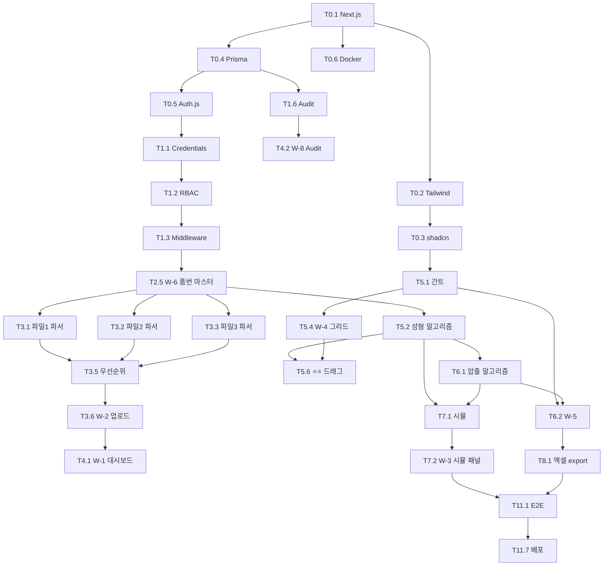

# 사내 생산 스케줄링 시스템 — WBS (Work Breakdown Structure)

| 항목 | 내용 |
|---|---|
| 문서명 | WBS — 상세 Task 분해 명세 |
| 문서 번호 | 20 |
| 버전 | v1.0 |
| 작성일 | 2026-05-10 |
| Owner 팀 | 경영기획 본부 |
| 문서 성격 | **GitHub Issue 추출용 Task 마스터 리스트** — 13 Sprint × 평균 6 Task = 약 120 Task |
| 입력 자료 | PRD #19 v1.4 (특히 §3 70 AC, 부록 I Sprint 분할) |
| 다음 산출물 | #21 Issue 추출 프롬프트 + Phase_D/issues/ 개별 명세서 |

---

# 1. 본 WBS 사용 방법

## 1.1 흐름
```
[1] 본 WBS에서 Sprint 단위 Task 식별
[2] Issue 추출 프롬프트(#21)로 5~10개 단위 Task → 상세 Issue 명세서 (.md) 생성
[3] Phase_D/issues/T{ID}_{slug}.md 형태로 저장
[4] 코딩 → AC 자동 검증 → 다음 Issue
```

## 1.2 Task ID 명명 규칙

```
T{Sprint}.{Major}.{Minor}

예: T1.3.2 = Sprint 1, 3번째 메이저 작업, 2번째 세부

Title (GitHub Issue): [Sprint {N}] T{ID}: {기능 요약}
예: [Sprint 5] T5.6: W-4 성형 간트 드래그·재배분 인터랙션 (J-MR-2 ⭐⭐)
```

## 1.3 Task 속성

| 필드 | 의미 |
|---|---|
| Task ID | T{N.X.Y} |
| 작업명 | 한 줄 요약 |
| 핵심 내용 | 무엇을 만드는가 |
| AC 매핑 | PRD §3 AC ID (예: AC PM-1-1) |
| F/R 매핑 | PRD §4 기능 트리 (F-2.4) / 요구사항 (R-7) |
| 의존성 | 선행 Task ID |
| 예상 시간 (h) | 단순 추정. 실제와 다를 수 있음 |

## 1.4 우선순위 (MoSCoW from PRD §4)
- 🔴 Must: P0 (MVP-1·2·3 필수)
- 🟡 Should: P1 (안정화)
- 🟢 Could: P2 (확장)

---

# 2. Sprint 0 — 프로젝트 셋업 (Must, 약 1주, 7 Task)

| Task ID | 작업명 | 핵심 내용 | AC/F/R | 의존성 | 예상 (h) |
|---|---|---|---|---|---|
| **T0.1** | Next.js 프로젝트 생성 | `npx create-next-app@latest` (App Router, TS, ESLint, Tailwind) + .env.example + .gitignore + 첫 커밋 | 부록 A | - | 4 |
| **T0.2** | Tailwind 4 설정 | `tailwind.config.ts` + `globals.css` + 다크모드 전략 + 한글 폰트(Pretendard) | 부록 B | T0.1 | 2 |
| **T0.3** | shadcn/ui 초기화 | `npx shadcn-ui@latest init` + 기본 컴포넌트 7종 (Button·Card·Input·Form·Toast·Dialog·DropdownMenu) | 부록 H | T0.2 | 3 |
| **T0.4** | Prisma + SQLite 셋업 | `prisma init` + 12개 모델 스키마(User·Item·Order 등) + 첫 마이그레이션 | 부록 C | T0.1 | 8 |
| **T0.5** | Auth.js v5 골격 | `next-auth` 설치 + `lib/auth.ts` + `[...nextauth]/route.ts` 빈 설정 | R-13 | T0.4 | 4 |
| **T0.6** | Docker 환경 | `Dockerfile` (멀티스테이지) + `docker-compose.yml` (app + postgres) + README | 부록 A | T0.1 | 4 |
| **T0.7** | Sprint 0 검증 | `npm run dev` + `docker-compose up` 정상 동작 + 빌드 통과 + 첫 PR | - | T0.1~6 | 2 |

**Sprint 0 합계: 약 27h ≈ 4일**

---

# 3. Sprint 1 — 인증·사용자 (Must, 약 1.5주, 8 Task) ★ R-13

| Task ID | 작업명 | 핵심 내용 | AC/F/R | 의존성 | 예상 (h) |
|---|---|---|---|---|---|
| **T1.1** | Auth.js Credentials Provider | id/pw 로그인 + bcrypt 해시(rounds=12) + 세션 8h | R-13, AC PM-3-2 | T0.5 | 6 |
| **T1.2** | RBAC 매트릭스 | `lib/permissions.ts` — 6 Role × 권한 enum, hasPermission() | R-13 | T1.1 | 4 |
| **T1.3** | middleware.ts 가드 | (auth) public, (dashboard) 인증 + 권한 체크, 403 페이지 | R-13, AC MR-1-F1 | T1.2 | 4 |
| **T1.4** | 로그인 화면 W-Login | `(auth)/login/page.tsx` shadcn Form + Zod + 5회 잠금 UI | R-13 | T1.3 | 6 |
| **T1.5** | 비밀번호 정책 | 8자+영문숫자특수, 90일 변경 알림, 5회 실패 잠금 (lock_until DB) | R-13 | T1.1 | 4 |
| **T1.6** | Audit 로그 헬퍼 | `lib/audit.ts` — logAudit(), 모든 변경 자동 기록 | R-13, AC PM-3-2 | T0.4 | 4 |
| **T1.7** | 시드 (Admin + 5 Role) | `prisma/seed.ts` — Admin 1, 페르소나 5 가상 계정 | - | T0.4 | 3 |
| **T1.8** | Sprint 1 E2E 테스트 | Playwright — 로그인/로그아웃/권한 가드/Audit 확인 | AC PM-3-2·3, AC MR-1-F1 | T1.1~7 | 6 |

**Sprint 1 합계: 약 37h ≈ 5일**

---

# 4. Sprint 2 — 마스터 데이터 M-1~M-4 (Must, 약 2주, 9 Task)

| Task ID | 작업명 | 핵심 내용 | AC/F/R | 의존성 | 예상 (h) |
|---|---|---|---|---|---|
| **T2.1** | 시드: 47 실리콘 품번 | Raw Materials/Vulcanization·Extrusion 엑셀에서 추출 → seed.ts | F-1.1, R-6 | T1.7 | 6 |
| **T2.2** | 시드: 장비 마스터 | 가류기 5대(LP×4, IC×1) + 압출기 2대(포드·신규), 슬롯 정의 | F-1.2 | T2.1 | 3 |
| **T2.3** | 시드: 운영 파라미터 | 회전수·근무시간·효율·1회전시간 (M-3, OperationParam) | F-1.3 | T0.4 | 2 |
| **T2.4** | 시드: 캘린더 1년치 | 영업일 + 주말 + 한국 공휴일 자동 생성 | F-1.4 | T0.4 | 3 |
| **T2.5** | W-6.1 품번 마스터 | TanStack Table + 인라인 편집 + alias 관리 + ERP 동기화 버튼 | F-1.1, AC PM-3-1, AC PM-3-F1 | T2.1 | 8 |
| **T2.6** | W-6.2 장비 마스터 | 가류기·압출기 CRUD | F-1.2 | T2.2 | 4 |
| **T2.7** | W-6.3 운영 파라미터 | 키-값 편집 (회전수·효율 등) + 변경 시 audit | F-1.3, R-9 | T1.6 | 4 |
| **T2.8** | W-7 캘린더 | shadcn Calendar 월간 + 일자 클릭 모달 (영업일/PM/임시휴무 토글) | F-1.4, R-10 | T2.4 | 6 |
| **T2.9** | ItemAlias 정규화 | `lib/etl/normalizer.ts` — trim, 공백·하이픈 제거, alias 매칭 | - | T2.1 | 4 |

**Sprint 2 합계: 약 40h ≈ 5일**

---

# 5. Sprint 3 — 수주 통합 (Must, 약 2주, 9 Task) ★ J-SP-1

| Task ID | 작업명 | 핵심 내용 | AC/F/R | 의존성 | 예상 (h) |
|---|---|---|---|---|---|
| **T3.1** | 파일 1 파서 (주간 계획) | `lib/etl/weekly-plan-parser.ts` — exceljs, Wide→Long unpivot | F-2.1 | T2.5 | 6 |
| **T3.2** | 파일 2 파서 (KD 발주) | `lib/etl/kd-order-parser.ts` — 'kd 발주' 시트만 | F-2.1, D16 | T2.5 | 5 |
| **T3.3** | 파일 3 파서 (월예상) | `lib/etl/monthly-forecast-parser.ts` — 1·2주차 unpivot, 출처 컬럼 | F-2.1 | T2.5 | 5 |
| **T3.4** | 자동 실리콘 필터 | `lib/etl/silicone-filter.ts` — 마스터 매칭, 미매칭 큐 적재 | D16, R-6 | T2.9 | 4 |
| **T3.5** | 통합 우선순위 룰 | `lib/etl/priority.ts` — 주간 ▶ KD/월예상 빠른 납기 (R-5) | R-5 | T3.1·2·3 | 5 |
| **T3.6** | W-2 엑셀 업로드 | `react-dropzone` + 미리보기 + Zod 검증 | AC SP-1-1, AC SP-1-F1·F2 | T3.5 | 8 |
| **T3.7** | 매핑 룰 GUI | W-6 일부, ExcelMappingRule CRUD (헤더 row·컬럼 위치 등) | F-2.2, R-9 | T2.5 | 6 |
| **T3.8** | W-3 변동 직접 입력 | shadcn Form + Zod + 시뮬 패널 자리 (시뮬은 Sprint 7) | F-2.4, R-7 확장, AC PM-1-F2 | T1.4 | 8 |
| **T3.9** | Sprint 3 통합 테스트 | 실 엑셀 3종 업로드 → DB 적재 검증 (Playwright) | AC SP-1-1·2·3 | T3.1~8 | 6 |

**Sprint 3 합계: 약 53h ≈ 7일**

---

# 6. Sprint 4 — 통합 대시보드 + Audit (Must, 약 1.5주, 6 Task)

| Task ID | 작업명 | 핵심 내용 | AC/F/R | 의존성 | 예상 (h) |
|---|---|---|---|---|---|
| **T4.1** | W-1 통합 대시보드 | 변동 알림 카드 + 주차별 수주 + KSF 미니 (placeholder) | F-2.3 | T3.6 | 8 |
| **T4.2** | W-8 변경 이력 | 시계열 timeline + 필터 (사용자·일자·테이블) | F-2.5, AC SP-2-3 | T1.6 | 6 |
| **T4.3** | 알림 시스템 | Notification 테이블 + 인앱 알림 벨 + Toast | AC SP-2-1·F1·F2 | T4.2 | 6 |
| **T4.4** | KSF Daily Snapshot Cron | 매일 23:55 — KSF 1·2·5·6 SQL 산출 → DB 적재 | §1.5 (PRD) | T0.4 | 5 |
| **T4.5** | 모니터링 인프라 (Loki·Prometheus·Grafana) | docker-compose 추가 + 시스템 메트릭 | §5.5 | T0.6 | 8 |
| **T4.6** | Sprint 4 통합 테스트 | 변동 입력 → 알림 → audit → 대시보드 갱신 흐름 | AC SP-2 시리즈 | T4.1~5 | 4 |

**Sprint 4 합계: 약 37h ≈ 5일**

---

# 7. ⭐⭐ Sprint 5 — 성형 스케줄러 (Must, 약 3주, 11 Task) ★ J-MR-2 도입 성패

| Task ID | 작업명 | 핵심 내용 | AC/F/R | 의존성 | 예상 (h) |
|---|---|---|---|---|---|
| **T5.1** | 간트 라이브러리 결정·도입 | TBD-1 결정 (Bryntum/DHTMLX/frappe-gantt) + 기본 설치 | - | T0.3 | 6 |
| **T5.2** | 성형 스케줄러 알고리즘 | `lib/scheduler/molding-scheduler.ts` — 백워드(D-2) + 슬롯 + 회전 분배 | R-1, R-3, AC MR-3-1 | T2.5 | 16 |
| **T5.3** | 관체 요청서 자동 생성 | 성형 → 압출로 PipeRequest 전달 | F-4.5 | T5.2 | 4 |
| **T5.4** | W-4 그리드 (가류기×슬롯×일자) | 간트 라이브러리 위에 도메인 데이터 매핑 | F-4.2, AC MR-1-1 | T5.1 | 10 |
| **T5.5** | W-4 색상 코딩 (품번별) | 47품번 색상 팔레트 + 범례 | AC MR-1 | T5.4 | 4 |
| **T5.6** | ⭐⭐ W-4 드래그·재배분 | **AC MR-2 충족 — J-MR-2 ⭐⭐ 핵심 인터랙션** | AC MR-2-1, R-11 | T5.4 | 12 |
| **T5.7** | W-4 룰 위반 경고 (차단 X) | 빨간 토스트 + audit `rule_violation=true` | AC MR-2-2 | T5.6 | 4 |
| **T5.8** | W-4 자동 vs 수동 시각 구분 | 회색/파란 테두리/초록 체크 (`status` enum 기반) | AC MR-2-3 | T5.6 | 4 |
| **T5.9** | "왜 이 결과?" 툴팁 | hover 시 알고리즘 근거 표시 | AC MR-3-2 | T5.4 | 4 |
| **T5.10** | 베테랑 친화 UI | 16px+ 글씨, 44×44px+ 버튼, 태블릿 회전 보존 | AC MR-1-2·F2 | T5.4 | 6 |
| **T5.11** | Sprint 5 통합 테스트 (J-MR-2 ⭐⭐ 검증) | Playwright + 47품번 × 14 슬롯 매트릭스 검증 (Vitest) | AC MR-1·2·3 모두 | T5.1~10 | 8 |

**Sprint 5 합계: 약 78h ≈ 10일** ⭐⭐ 가장 중요한 Sprint

---

# 8. Sprint 6 — 압출 스케줄러 (Must, 약 2주, 7 Task)

| Task ID | 작업명 | 핵심 내용 | AC/F/R | 의존성 | 예상 (h) |
|---|---|---|---|---|---|
| **T6.1** | 압출 스케줄러 알고리즘 | E그룹·헤드핀 묶음 + 신규 우선 + D-1 백워드 | R-2, R-3, AC ER-1-1, AC ER-3-1 | T5.3 | 16 |
| **T6.2** | W-5 그리드 (라인×근무×일자) | 간트 (compose 또는 같은 라이브러리) | F-5.2, AC ER-2-3 | T5.1 | 8 |
| **T6.3** | W-5 색상 코딩 (E그룹별) | 1~8 색상 팔레트 + 묶음 시각화 | AC ER-1-2 | T6.2 | 4 |
| **T6.4** | 다이/노즐 변경 카운터 | KSF-2 시각화 — 일별 setup_change_count | KSF-2, AC ER-1-3 | T6.1 | 4 |
| **T6.5** | 부하 분산 그래프 | 신규 vs 포드 가동률 동시 표시 (Recharts) | AC ER-3-2·3·F2 | T6.2 | 6 |
| **T6.6** | W-5 수동 조정 + 확정 | 드래그·재배분 + AC ER-2 | AC ER-2 | T6.2 | 8 |
| **T6.7** | Sprint 6 통합 테스트 | 47품번 다이 -30% 시뮬 + 부하 ≤10% | AC ER-1·2·3 | T6.1~6 | 6 |

**Sprint 6 합계: 약 52h ≈ 7일**

---

# 9. Sprint 7 — 영향 시뮬레이션 (Must, 약 1.5주, 5 Task) ★ J-PM-1

| Task ID | 작업명 | 핵심 내용 | AC/F/R | 의존성 | 예상 (h) |
|---|---|---|---|---|---|
| **T7.1** | 영향 시뮬 알고리즘 | `lib/scheduler/impact-simulator.ts` — 진행중 건 자동 식별 + dryRun 재계산 | R-8, AC PM-1-1 | T5.2, T6.1 | 12 |
| **T7.2** | W-3에 시뮬 패널 통합 | 변동 입력 즉시 영향 시각화 (5분 → 5초 목표) | F-2.4, AC PM-1-1·2 | T3.8, T7.1 | 6 |
| **T7.3** | 진행중 건 색상 코딩 | 🔴(STARTED) / 🟡(CONFIRMED) / 🟢(AUTO) | AC PM-1-1 | T7.2 | 4 |
| **T7.4** | W-4·W-5에 영향받는 건 표시 | 시뮬 결과 → 간트에 하이라이트 | F-4.4, F-5.4 | T7.2 | 6 |
| **T7.5** | Sprint 7 통합 테스트 (KSF-3 검증) | 변동 1건 입력 → 5초 내 시각화 (Playwright) | AC PM-1 시리즈 | T7.1~4 | 6 |

**Sprint 7 합계: 약 34h ≈ 4.5일**

---

# 10. Sprint 8 — 출력 (Must, 약 1주, 4 Task)

| Task ID | 작업명 | 핵심 내용 | AC/F/R | 의존성 | 예상 (h) |
|---|---|---|---|---|---|
| **T8.1** | 엑셀 export (성형·압출) | `exceljs` — 시트별 일자 + 요약 시트 (이전 docx 양식 호환) | F-6.1 | T6.6 | 8 |
| **T8.2** | 작업지시서 PDF | `react-pdf` — 일별·라인별 작업지시서 | F-6.2 | T6.6 | 6 |
| **T8.3** | 분기 보고서 export | KPI Before/After + 차트 | AC EX-2-2·F2 | T4.4 | 6 |
| **T8.4** | Sprint 8 테스트 | 출력 형식·레이아웃 검증 | F-6 | T8.1~3 | 4 |

**Sprint 8 합계: 약 24h ≈ 3일**

---

# 11. Sprint 9 — MES 연동 (Should, 약 2주, 6 Task) — TBD-3 후

| Task ID | 작업명 | 핵심 내용 | AC/F/R | 의존성 | 예상 (h) |
|---|---|---|---|---|---|
| **T9.1** | MES 클라이언트 인터페이스 | `lib/mes/IMesClient.ts` 추상 + 구현체 | D20 추상화 | - | 4 |
| **T9.2** | 실적 수집 API | `app/api/mes/result/route.ts` (POST 또는 Pull) | F-7.1, AC MR-1-3 | T9.1 | 6 |
| **T9.3** | ProductionResult → Inventory 자동 갱신 | 실적 적재 시 재고 트랜잭션 | F-3.3 | T9.2 | 4 |
| **T9.4** | 작업지시 송신 API | `app/api/mes/instruction/route.ts` (확정 시 자동 송신) | F-7.2, AC PM-2-3 | T9.1 | 6 |
| **T9.5** | 5분 폴링 또는 Webhook | Cron 또는 webhook 수신 + 재시도 큐 | AC ER-2-F1 | T9.2·4 | 6 |
| **T9.6** | MES 통합 테스트 | Mock MES + 실 연동 | AC MR-1-3 | T9.1~5 | 6 |

**Sprint 9 합계: 약 32h ≈ 4일**

---

# 12. Sprint 10 — 영림원 ERP 연동 (Should, 약 1주, 4 Task) — TBD-2 후

| Task ID | 작업명 | 핵심 내용 | AC/F/R | 의존성 | 예상 (h) |
|---|---|---|---|---|---|
| **T10.1** | ERP 클라이언트 인터페이스 | `lib/erp/IErpClient.ts` 추상 | D7 | - | 3 |
| **T10.2** | 야간 동기화 API | `app/api/erp/sync/route.ts` — 품번/BOM/거래처 갱신 | F-1.1 | T10.1 | 6 |
| **T10.3** | Cron 스케줄 (매일 03:00) | 컨테이너 cron 또는 Vercel Cron 대체 | - | T10.2 | 3 |
| **T10.4** | ERP 통합 테스트 | 모의 데이터 + 마스터 변경 검증 | F-1.1 | T10.1~3 | 4 |

**Sprint 10 합계: 약 16h ≈ 2일**

---

# 13. Sprint 11 — 통합 테스트·배포 (Must, 약 2주, 8 Task)

| Task ID | 작업명 | 핵심 내용 | AC/F/R | 의존성 | 예상 (h) |
|---|---|---|---|---|---|
| **T11.1** | E2E 14 Story 흐름 (Playwright) | 페르소나별 핵심 시나리오 자동화 | §3 모두 | T7~8 | 16 |
| **T11.2** | k6 부하 테스트 | 동시 20명·5분, p95 임계치 검증 | §5.1 | T11.1 | 8 |
| **T11.3** | 보안 스캔 | npm audit + OWASP ZAP 월 1회 | §5.5 | T0.7 | 4 |
| **T11.4** | Lighthouse CI | Web Vitals + p95 ≤ 1500ms 검증 | §5.1 | T0.7 | 3 |
| **T11.5** | Sentry self-hosted 통합 | 에러 추적·릴리스 | §5.5 | T4.5 | 4 |
| **T11.6** | Grafana 대시보드 (KSF + 시스템) | KSF 6개 + 시스템 메트릭 + 알림 | §5.5.3 | T4.5 | 8 |
| **T11.7** | 사내 서버 배포 | docker-compose prod + nginx 리버스프록시 | §13 | T11.1~6 | 8 |
| **T11.8** | 운영 매뉴얼 + 백업 스크립트 | README + cron 백업 → NAS | §5.2 | T11.7 | 6 |

**Sprint 11 합계: 약 57h ≈ 7일**

---

# 14. Sprint 12.1 — P2-A OR-Tools 마이크로서비스 스켈레톤 (Could, 약 1주, 4 Task)

| Task ID | 작업명 | 핵심 내용 | AC/F/R | 의존성 | 예상 (h) |
|---|---|---|---|---|---|
| **T12.1.1** | Python FastAPI 프로젝트 + Docker | `solver-svc/` 별도 폴더, 멀티스테이지 빌드 | F-8.1 | T11.7 | 6 |
| **T12.1.2** | /health + 인증 미들웨어 | API Key 검증 + Health endpoint | - | T12.1.1 | 3 |
| **T12.1.3** | Next.js ↔ Solver 어댑터 | `lib/scheduler/solver-client.ts` (HTTP 호출 + 타입 안전) | D20 추상화 | T12.1.2 | 5 |
| **T12.1.4** | docker-compose 통합 | app + solver-svc + DB 한 번에 기동 | - | T12.1.1 | 3 |

**Sprint 12.1 합계: 약 17h ≈ 2일**

---

# 15. Sprint 12.2 — P2-B OR-Tools CP-SAT 알고리즘 (Could, 약 2주, 5 Task)

| Task ID | 작업명 | 핵심 내용 | AC/F/R | 의존성 | 예상 (h) |
|---|---|---|---|---|---|
| **T12.2.1** | OR-Tools CP-SAT 성형 모델 | 슬롯 변수 + 위치 제약 + 회전수 제약 | F-8.1, R-1 | T12.1.3 | 16 |
| **T12.2.2** | OR-Tools CP-SAT 압출 모델 | E그룹·헤드핀 그룹화 + 부하 균형 | F-8.1, R-2 | T12.2.1 | 12 |
| **T12.2.3** | 솔버 단위 테스트 | pytest — 47품번 입력, 다이 변경 -30% 검증 | F-8.1 | T12.2.2 | 6 |
| **T12.2.4** | 룰베이스 vs 솔버 비교 | Solver result vs Rule-based result diff | F-8.1 | T12.2.3 | 4 |
| **T12.2.5** | Sprint 12.2 통합 테스트 | Next.js → Solver → 결과 검증 | F-8.1 | T12.2.1~4 | 6 |

**Sprint 12.2 합계: 약 44h ≈ 6일**

---

# 16. Sprint 12.3 — P2-C 통합 + 부하 튜닝 (Could, 약 1주, 4 Task)

| Task ID | 작업명 | 핵심 내용 | AC/F/R | 의존성 | 예상 (h) |
|---|---|---|---|---|---|
| **T12.3.1** | 본 시스템에서 솔버 호출 | 토글 (룰베이스 vs 솔버) | F-8.1 | T12.2.5 | 6 |
| **T12.3.2** | W-4·W-5에 솔버 결과 비교 UI | 다이 변경 횟수 비교 카드 | AC ER-1-3 | T12.3.1 | 6 |
| **T12.3.3** | 부하 테스트 (k6 p95 ≤ 30s) | 솔버 응답 시간 측정 | §5.1 | T12.3.1 | 4 |
| **T12.3.4** | 정확도 검증 | 다이 변경 -30% 자동 비교 | KSF-2 | T12.3.3 | 4 |

**Sprint 12.3 합계: 약 20h ≈ 2.5일**

---

# 17. Sprint 12.4 — AD/LDAP SSO (Could, 약 1주, 4 Task)

| Task ID | 작업명 | 핵심 내용 | AC/F/R | 의존성 | 예상 (h) |
|---|---|---|---|---|---|
| **T12.4.1** | AD/LDAP 연동 검토 | 사내 IT 정책 확인 + Auth.js LDAP adapter | D18 | T1.1 | 4 |
| **T12.4.2** | LDAP Provider 추가 | Auth.js Custom Provider 또는 ldap-passport | D18 | T12.4.1 | 6 |
| **T12.4.3** | 자체 ID/PW ↔ SSO 마이그레이션 | 사용자 매핑 + 점진 전환 | D18 | T12.4.2 | 4 |
| **T12.4.4** | SSO 통합 테스트 | 사내 AD 더미 또는 Mock | R-13 | T12.4.3 | 4 |

**Sprint 12.4 합계: 약 18h ≈ 2.5일**

---

# 18. Sprint 12.5 — F-9 모바일 KSF 대시보드 PWA (Could, 약 1주, 6 Task)

| Task ID | 작업명 | 핵심 내용 | AC/F/R | 의존성 | 예상 (h) |
|---|---|---|---|---|---|
| **T12.5.1** | PWA Manifest + Service Worker | 오프라인 캐시 전략 (J-EX-1·F1 대응) | F-9, AC EX-1-F1 | T11.7 | 6 |
| **T12.5.2** | KSF 모바일 대시보드 화면 | 6 KSF 한 화면, 카드형 + 시계열 그래프 | F-9, AC EX-1-1·2·3 | T12.5.1 | 8 |
| **T12.5.3** | Before/After 자동 비교 | KSF 도입 전후 차트 | F-9, AC EX-2-1 | T12.5.2 | 4 |
| **T12.5.4** | KPI 로딩 스켈레톤 | 5초+ 지연 시 점진 로딩 | AC EX-1-F2 | T12.5.2 | 4 |
| **T12.5.5** | 분기 보고서 자동 생성 | 30분 → 30초 (T8.3 모바일 호환) | AC EX-2-2 | T8.3 | 4 |
| **T12.5.6** | Sprint 12.5 모바일 테스트 | Playwright mobile viewport (320px+) | AC EX-1·2 | T12.5.1~5 | 4 |

**Sprint 12.5 합계: 약 30h ≈ 4일**

---

# 19. Sprint 12.6 — F-8.2 EPDM·NBR 등 타 재료 확대 (Could, 약 1주, 4 Task)

| Task ID | 작업명 | 핵심 내용 | AC/F/R | 의존성 | 예상 (h) |
|---|---|---|---|---|---|
| **T12.6.1** | 재료 enum 확장 | "silicone" → "silicone"·"epdm"·"nbr" 등 | R-6 | T0.4 | 2 |
| **T12.6.2** | 재료별 마스터·시드 추가 | EPDM·NBR 품번 시드 (실 데이터 입력 시) | F-8.2 | T2.1 | 6 |
| **T12.6.3** | 재료 필터 UI | W-1·W-2·W-3 등 모든 화면에 재료 선택 | F-8.2, R-6 | T4.1 | 4 |
| **T12.6.4** | 재료별 KSF 산출 | KSF SQL을 재료별로 분리 | KSF | T4.4 | 4 |

**Sprint 12.6 합계: 약 16h ≈ 2일**

---

# 20. Sprint 12.7 — Ollama 사내 LLM (Could 선택, 약 1주, 4 Task)

| Task ID | 작업명 | 핵심 내용 | AC/F/R | 의존성 | 예상 (h) |
|---|---|---|---|---|---|
| **T12.7.1** | Ollama 사내 배포 | docker-compose에 Ollama 서비스 + 모델 다운로드 | - | T11.7 | 6 |
| **T12.7.2** | LLM 클라이언트 인터페이스 | `lib/llm/IL​lmProvider.ts` 추상 | D20 추상화 | - | 3 |
| **T12.7.3** | 자연어 변동 입력 시연 | "RH-A123 200개 5/22로 변경" → 폼 자동 채우기 | F-2.4 보강 | T3.8 | 6 |
| **T12.7.4** | 비용·정확도 검증 | 응답 시간·정확도 측정 | - | T12.7.3 | 3 |

**Sprint 12.7 합계: 약 18h ≈ 2.5일**

---

# 21. 종합 요약

## 21.1 Task 분포

| Sprint | Task 수 | 예상 시간(h) | 예상 일수 | 우선순위 |
|---|---|---|---|---|
| Sprint 0 | 7 | 27 | 4일 | Must |
| Sprint 1 | 8 | 37 | 5일 | Must |
| Sprint 2 | 9 | 40 | 5일 | Must |
| Sprint 3 | 9 | 53 | 7일 | Must |
| Sprint 4 | 6 | 37 | 5일 | Must |
| **Sprint 5 ⭐⭐** | **11** | **78** | **10일** | **Must** |
| Sprint 6 | 7 | 52 | 7일 | Must |
| Sprint 7 | 5 | 34 | 4.5일 | Must |
| Sprint 8 | 4 | 24 | 3일 | Must |
| Sprint 9 | 6 | 32 | 4일 | Should |
| Sprint 10 | 4 | 16 | 2일 | Should |
| Sprint 11 | 8 | 57 | 7일 | Must |
| Sprint 12.1 | 4 | 17 | 2일 | Could |
| Sprint 12.2 | 5 | 44 | 6일 | Could |
| Sprint 12.3 | 4 | 20 | 2.5일 | Could |
| Sprint 12.4 | 4 | 18 | 2.5일 | Could |
| Sprint 12.5 | 6 | 30 | 4일 | Could |
| Sprint 12.6 | 4 | 16 | 2일 | Could |
| Sprint 12.7 | 4 | 18 | 2.5일 | Could (선택) |
| **합계** | **115 Task** | **약 650h** | **약 85일 (4개월 1인)** | |

> ⚠️ **시간 추정 주의**: 단순 코딩 시간만. 검토·디버그·재작업·문서화 등 포함 시 1.5~2배 가능.

## 21.2 Must (P0 — MVP) 합계
- Sprint 0~8 + Sprint 11 = **74 Task, 약 439h, 약 56일**
- → **MVP 출시까지 약 8주 (1인)**, 2인 페어 시 약 5~6주

## 21.3 Should (P1) — Sprint 9·10 = **10 Task, 약 48h ≈ 6일**

## 21.4 Could (P2) — Sprint 12.1~12.7 = **31 Task, 약 163h ≈ 21일**

## 21.5 Critical Path (가장 긴 의존 사슬)

```
T0.1 → T0.4 → T2.1 → T2.5 → T3.5 → T3.6 → T7.1 → T7.2 → T11.1 → T11.7
(Setup → DB → 마스터 → 수주 → 시뮬 → E2E → 배포)
약 6주
```

병렬 가능 작업 묶음:
- T0.2·T0.3 (Tailwind·shadcn)
- T0.5·T0.6 (Auth·Docker)
- T2.2·T2.3·T2.4 (시드 데이터)
- T5.6·T5.7·T5.8 (성형 UI 인터랙션)

---

# 22. 의존성 다이어그램 (주요 흐름)



---

# 23. Issue 추출 작업 단위 (#21 프롬프트로 처리 시)

각 Sprint를 **5~10 Task 단위로 묶어 한 번에 Issue 추출**하는 권장 그룹:

| 그룹 | Task 범위 | 작업 분량 |
|---|---|---|
| G1 | T0.1~T0.7 (Sprint 0 전체, 7) | 1 회 |
| G2 | T1.1~T1.8 (Sprint 1 전체, 8) | 1 회 |
| G3 | T2.1~T2.9 (Sprint 2 전체, 9) | 1 회 |
| G4 | T3.1~T3.9 (Sprint 3 전체, 9) | 1 회 |
| G5 | T4.1~T4.6 (Sprint 4 전체, 6) | 1 회 |
| G6 | T5.1~T5.5 (Sprint 5 절반, 5) | 1 회 |
| G7 | T5.6~T5.11 (Sprint 5 ⭐⭐ 핵심, 6) | 1 회 |
| G8 | T6.1~T6.7 (Sprint 6 전체, 7) | 1 회 |
| G9 | T7.1~T7.5 + T8.1~T8.4 (Sprint 7+8, 9) | 1 회 |
| G10 | T9·T10·T11 (Should + 배포, 18) | 2~3 회 |
| G11 | T12.1~T12.7 (P2 모두, 31) | 4~5 회 |

→ **총 약 14~15회 Issue 추출 작업** 필요.

---

# 24. 다음 단계

| 단계 | 산출물 | 시점 |
|---|---|---|
| **1** | **#21 — Issue 추출 프롬프트 (우리 버전)** | 다음 (30분) |
| 2 | G1 (Sprint 0) Issue 7건 추출 → `Phase_D/issues/` | 그 후 (1시간) |
| 3 | Sprint 0 코드 시작 (각 Issue 단위) | 그 후 |
| 4~ | Sprint별 Issue 추출 → 코드 → 검증 반복 | 8주 (MVP 기준) |

---

# 25. 변경 이력

| 버전 | 일자 | 내용 | 작성자 |
|---|---|---|---|
| v1.0 | 2026-05-10 | WBS 최초 작성. 13 Sprint × 평균 6 Task = **115 Task** + 의존성 + 예상 시간 + Critical Path + Mermaid 의존성 다이어그램 + Issue 추출 그룹 14~15회 단위 | 경영기획 본부 |

---

**[문서 끝 — WBS v1.0]**
